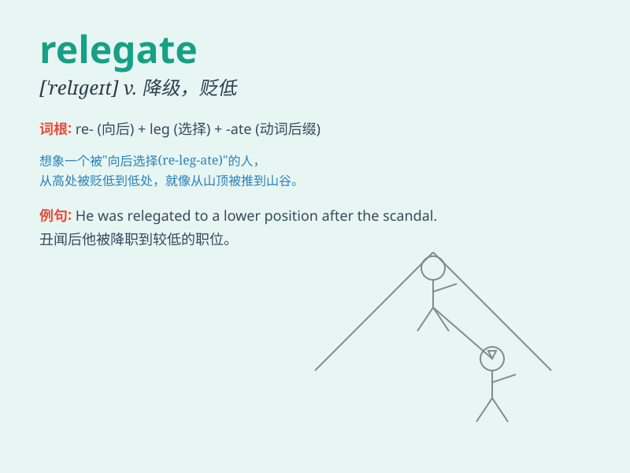

## relegate

**英音:** _[\'relɪgeɪt]_ **美音:** _[\'rɛlɪɡet]_

**译义:** *v.转移,归入,提交*

### 短语

+ **relegate to:** _把\...降级；把\...置于次要地位_

+ **be relegated:** _被降级；被降职_

+ **relegate from:** _从\...降级_

+ **relegate something/someone to oblivion:** _使某物/某人被遗忘_

+ **relegate the matter to:** _把这件事交给\..._

### 例句

#### 例句1

> **The team was relegated to a lower division at the end of the
season.**

**中文翻译:** 这个队在赛季末被降级到了更低的级别。

**单词释义:** 使降级；使降职

#### 例句2

> **He was relegated to a minor position in the company.**

**中文翻译:** 他在公司被降到了一个次要的职位。

**单词释义:** 使降职；使降级

#### 例句3

> **The problem was relegated to the back burner due to more urgent
matters.**

**中文翻译:** 由于更紧急的事情，这个问题被搁置一旁。

**单词释义:** 把...置于次要地位；使退居次要

### 背诵小故事

> A poor athlete was relegate d from the national team to a local club.
He felt very sad but decided to train harder to regain his position.
Relegate here means to demote or assign to a lower position.

**一位表现不佳的运动员被从国家队降级到了当地的俱乐部。他非常伤心，但决定更努力训练以重获自己的位置。relegate
在此意为降级、贬谪、把\...置于次要地位。**

### 图义

