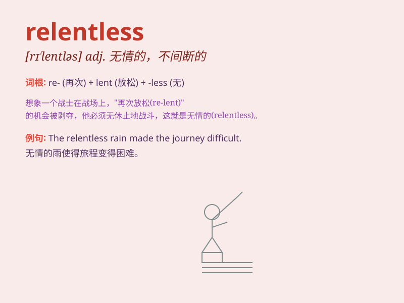

## relentless

**英音:** _[rɪ\'lentlɪs]_ **美音:** _[rɪ\'lɛntləs]_

**译义:** *adj.无情的*

### 短语

+ **relentless pursuit:** _不懈的追求_

+ **relentless pressure:** _持续不断的压力_

+ **relentless attack:** _无情的攻击_

+ **relentless effort:** _不懈的努力_

+ **relentless progress:** _持续的进步_

### 例句

#### 例句1

> **The athlete showed relentless determination during the
training.**

**中文翻译:** 这位运动员在训练中表现出了不懈的决心。

**单词释义:** 不懈的；持续的

#### 例句2

> **The rain was relentless, pouring down for hours without
stopping.**

**中文翻译:** 雨不停地下，持续了好几个小时。

**单词释义:** 不停的；持续不断的

#### 例句3

> **She faced the relentless criticism with courage.**

**中文翻译:** 她勇敢地面对无情的批评。

**单词释义:** 无情的；残酷的

### 背诵小故事

> A brave explorer was on a journey in a harsh desert. The sun was
relentless, shining fiercely without a moment\'s break. But the explorer
didn\'t give up and kept going. Here, relentless means unceasing or
persistent.

**一位勇敢的探险家在一片恶劣的沙漠中旅行。太阳毫不留情，持续强烈地照射着。但探险家没有放弃，继续前行。在这里，relentless
意味着不停歇的或坚持不懈的。**

### 图义

