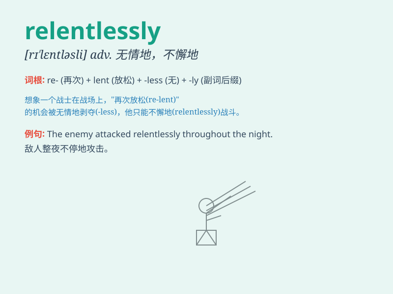

## relentlessly

**英音:** _[rɪˈlɛntlɪsli]_ **美音:** _[rɪˈlɛntləsli]_

**译义:** *adv.无情地,残酷地*

### 短语

+ **relentlessly pursue:** _不懈地追求_

+ **relentlessly attack:** _无情地攻击_

+ **relentlessly criticize:** _毫不留情地批评_

+ **relentlessly strive:** _持续不断地努力_

+ **relentlessly search:** _坚持不懈地搜寻_

### 例句

#### 例句1

> **He pursued his goals relentlessly.**

**中文翻译:** 他坚持不懈地追求自己的目标。

**单词释义:** 坚持不懈地

#### 例句2

> **The rain fell relentlessly all day.**

**中文翻译:** 雨一整天不停地下着。

**单词释义:** 不停地

#### 例句3

> **She criticized him relentlessly for his mistakes.**

**中文翻译:** 她因为他的错误毫不留情地批评他。

**单词释义:** 毫不留情地

### 背诵小故事

> A brave adventurer was determined to reach the top of the mountain.
He climbed relentlessly, ignoring the harsh weather and difficult
terrain. His perseverance was amazing.

**一位勇敢的冒险家决心登上山顶。他坚持不懈地攀爬，不顾恶劣的天气和艰难的地形。他的这种不屈不挠令人惊叹。**

### 图义

