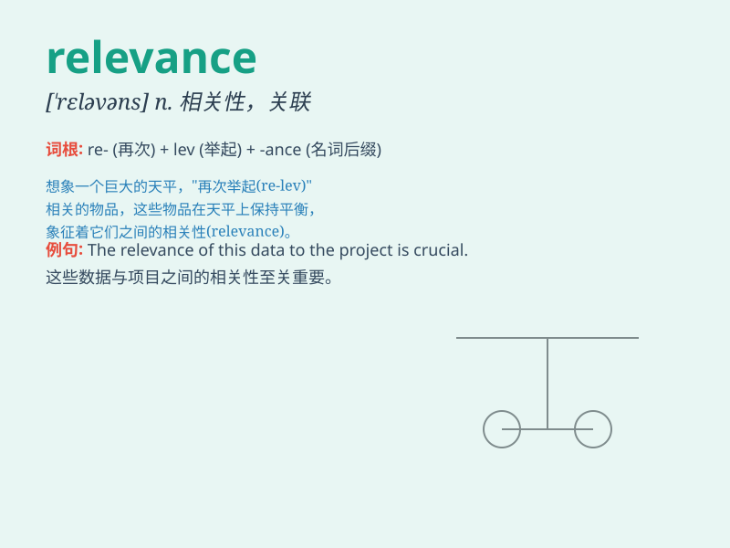

## relevance

**英音:** _[\'reləvəns]_ **美音:** _[\'rɛləvəns]_

**译义:** *n.中肯,适当*

### 短语

+ **relevance to:** _与\...\...有关_

+ **of relevance:** _有关的_

+ **have relevance:** _具有相关性_

+ **lose relevance:** _失去相关性_

+ **growing relevance:** _日益增长的相关性_

### 例句

#### 例句1

> **The relevance of this theory to our daily lives is not
immediately obvious.**

**中文翻译:** 这个理论与我们日常生活的相关性并非一眼就能看出来。

**单词释义:** 相关性

#### 例句2

> **The report lacks relevance to the current economic situation.**

**中文翻译:** 这份报告与当前的经济形势缺乏相关性。

**单词释义:** 相关性

#### 例句3

> **He questioned the relevance of the new law in modern society.**

**中文翻译:** 他质疑新法律在现代社会中的相关性。

**单词释义:** 相关性

### 背诵小故事

> A detective was solving a mystery. He found many clues, but only some
had relevance. The relevant ones led him to the criminal. Remember,
relevance means the connection or importance to a matter.

**一位侦探在破解一个谜团。他发现了许多线索，但只有一些有相关性。有相关性的那些线索让他找到了罪犯。记住，relevance
意思是与某件事的关联或重要性。**

### 图义

