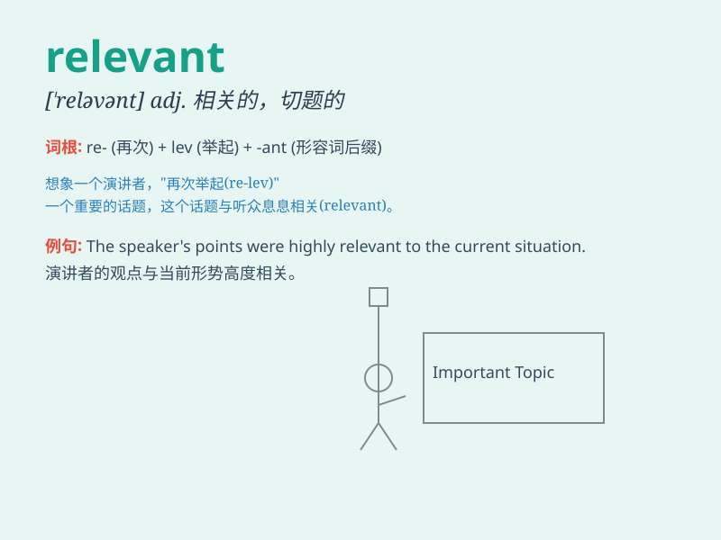

## relevant

**英音:** _[ˈreləvənt]_ **美音:** _[\'rɛləvənt]_

**译义:** *adj.有关的,相应的*

### 短语

+ **relevant information:** _相关信息_

+ **relevant experience:** _相关经验_

+ **relevant data:** _相关数据_

+ **relevant factor:** _相关因素_

+ **relevant issue:** _相关问题_

### 例句

#### 例句1

> **The information you provided is not relevant to the case.**

**中文翻译:** 你提供的信息与这个案子无关。

**单词释义:** 有关的；相关的

#### 例句2

> **These documents are relevant to our research.**

**中文翻译:** 这些文件与我们的研究相关。

**单词释义:** 相关的；有关联的

#### 例句3

> **He always comes up with relevant suggestions.**

**中文翻译:** 他总是提出相关的建议。

**单词释义:** 切题的；有价值的

### 背诵小故事

> A detective was looking for relevant clues to solve the mystery.
Every piece of evidence had to be directly related to the case. Finally,
he found the relevant document and cracked the case.

**一位侦探正在寻找与案件相关的线索来破案。每一个证据都必须与案件直接相关。最后，他找到了相关的文件并破了案。**

### 图义

