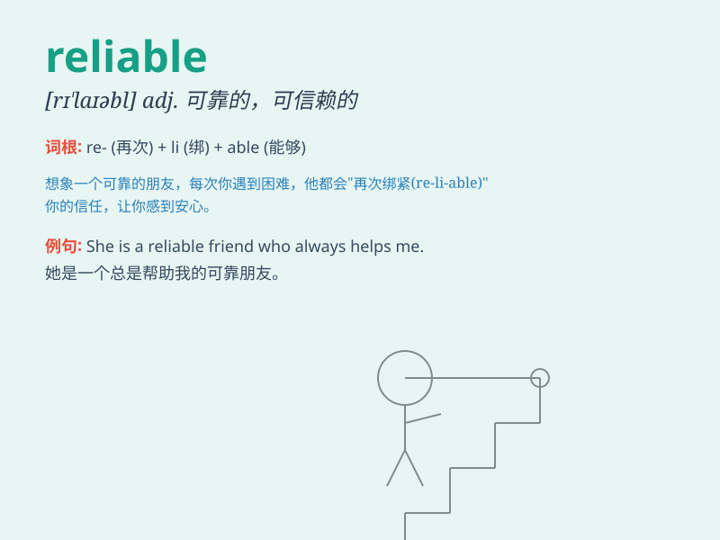

## reliable

**英音:** _[rɪ\'laɪəb(ə)l]_ **美音:** _[rɪ\'laɪəbl]_

**译义:** *adj.可靠的,可信赖的*

### 短语

+ **reliable information:** _可靠的信息_

+ **reliable source:** _可靠的来源_

+ **reliable evidence:** _可靠的证据_

+ **reliable partner:** _可靠的伙伴_

+ **reliable service:** _可靠的服务_

### 例句

#### 例句1

> **This car is very reliable. It never breaks down.**

**中文翻译:** 这辆车非常可靠。它从不抛锚。

**单词释义:** 可靠的；可信赖的

#### 例句2

> **She is a reliable friend. You can always count on her.**

**中文翻译:** 她是个可靠的朋友。你总是可以依靠她。

**单词释义:** 可靠的；值得信赖的

#### 例句3

> **The weather forecast is not always reliable.**

**中文翻译:** 天气预报并非总是可靠的。

**单词释义:** 可靠的；可信的

### 背诵小故事

> A young man was looking for a reliable partner to start a business.
He met many people, but only one was always there on time, kept
promises, and did excellent work. This person was truly reliable.

**一个年轻人正在寻找一个可靠的合作伙伴来创业。他见了很多人，但只有一个人总是按时出现，信守承诺，工作出色。这个人真的很可靠。**

### 图义

