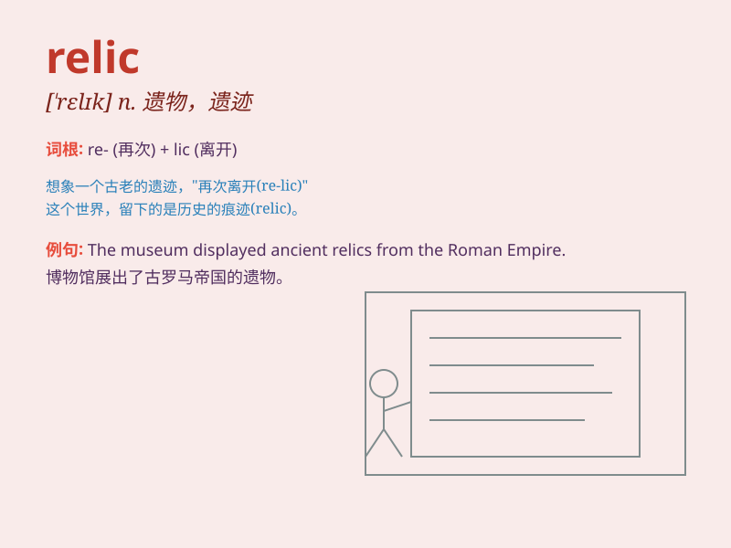

## relic

**英音:** _[\'relɪk]_ **美音:** _[\'rɛlɪk]_

**译义:** *n.遗物,遗迹,废墟,纪念物*

### 短语

+ **cultural relic:** _文化遗产_

+ **historical relic:** _历史遗迹_

+ **relic site:** _遗址_

+ **precious relic:** _珍贵的遗物_

+ **ancient relic:** _古代遗物_

### 例句

#### 例句1

> **The museum houses many ancient relics.**

**中文翻译:** 这个博物馆收藏了许多古代的遗物。

**单词释义:** 遗物；遗迹

#### 例句2

> **This old building is a relic of the past.**

**中文翻译:** 这座古老的建筑是过去的遗迹。

**单词释义:** 遗迹；遗留物

#### 例句3

> **The relics of the saint are kept in the church.**

**中文翻译:** 这位圣人的遗物保存在教堂里。

**单词释义:** 遗物；遗骨

### 背诵小故事

> A brave archaeologist was exploring an ancient tomb. In a hidden
corner, he found a relic - a golden necklace. It was a precious item
left by an ancient queen. The relic shone brightly, as if telling its
story through the ages.

**一位勇敢的考古学家正在探索一座古墓。在一个隐蔽的角落，他发现了一件遗物------一条金项链。这是古代一位女王留下的珍贵物品。这件遗物闪闪发光，仿佛在诉说着它的古老故事。**

### 图义

