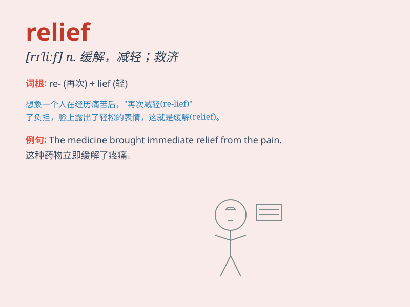

## relief

**英音:** _[rɪ\'liːf]_ **美音:** _[rɪ\'lif]_

**译义:**
*n.(痛苦等的)减轻,(债务等的)免除,救济,调剂,安慰,浮雕,地貌*

### 短语

+ **relief fund:** _救济基金_

+ **relief work:** _救济工作_

+ **tax relief:** _税收减免_

+ **disaster relief:** _救灾_

+ **feel relief:** _感到宽慰_

### 例句

#### 例句1

> **The news brought great relief to her.**

**中文翻译:** 这个消息给她带来了极大的宽慰。

**单词释义:** 宽慰；解脱

#### 例句2

> **Relief workers were sent to the disaster area.**

**中文翻译:** 救援人员被派往灾区。

**单词释义:** 救援；救济

#### 例句3

> **The painkillers gave her some relief.**

**中文翻译:** 止痛药让她的疼痛得到了一些缓解。

**单词释义:** 缓解；减轻

### 背诵小故事

> A poor man was in great pain. But when he received a large sum of
money as aid, he felt relief. The money solved his problems and brought
him comfort and a sense of release from worry.

**一个穷人非常痛苦。但当他收到一大笔援助资金时，他感到如释重负。这笔钱解决了他的问题，给他带来了安慰和摆脱忧虑的轻松感。**

### 图义

