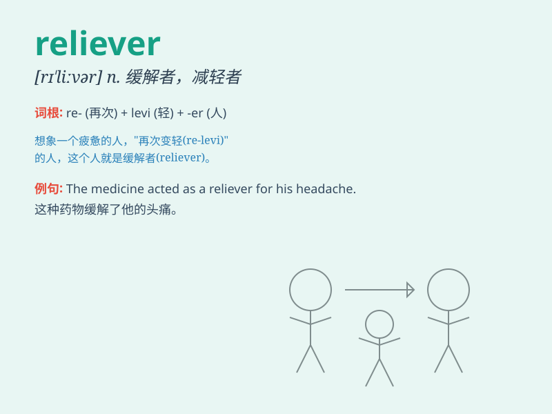

## reliever

**英音:** _[rɪˈliːvə(r)]_ **美音:** _[rɪˈliːvər]_

**译义:** *n.救济者*

### 短语

+ **pain reliever:** _止痛药_

+ **stress reliever:** _减压方式；缓解压力的事物_

+ **tension reliever:** _缓解紧张的事物_

+ **symptom reliever:** _症状缓解剂_

+ **anxiety reliever:** _缓解焦虑的事物_

### 例句

#### 例句1

> **The pain reliever helped her feel better after the surgery.**

**中文翻译:** 这种止痛药在她手术后帮助她感觉好多了。

**单词释义:** 止痛药

#### 例句2

> **He is a stress reliever for me when I\'m having a hard time.**

**中文翻译:** 当我日子艰难时，他是我的减压剂。

**单词释义:** 减压的人或物

#### 例句3

> **The new game is a great reliever of boredom.**

**中文翻译:** 这款新游戏是消除无聊的好办法。

**单词释义:** 消除无聊的事物

### 背诵小故事

> A brave firefighter was the reliever in a big fire. When people were
trapped and scared, he came and saved them. His actions made everyone
feel safe and relieved. Remember, a reliever brings relief!

**一位勇敢的消防员在一场大火中成为了救援者。当人们被困且感到害怕时，他来了并拯救了他们。他的行动让每个人都感到安全和宽慰。记住，reliever
就是带来宽慰的人！**

### 图义

