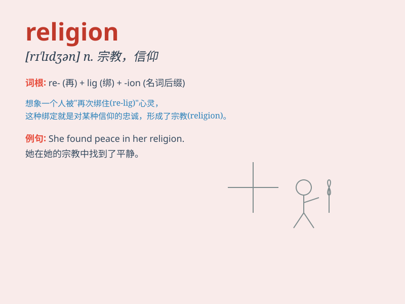

## religion

**英音:** _[rɪ\'lɪdʒ(ə)n]_ **美音:** _[rɪ\'lɪdʒən]_

**译义:** *n.宗教,信仰*

### 短语

+ **religious belief:** _宗教信仰_

+ **freedom of religion:** _宗教自由_

+ **world religion:** _世界宗教_

+ **religious ceremony:** _宗教仪式_

+ **religious education:** _宗教教育_

### 例句

#### 例句1

> **She has a deep interest in different religions.**

**中文翻译:** 她对不同的宗教有着浓厚的兴趣。

**单词释义:** 宗教

#### 例句2

> **Religion plays an important role in his life.**

**中文翻译:** 宗教在他的生活中起着重要的作用。

**单词释义:** 宗教

#### 例句3

> **The study of religion can broaden our horizons.**

**中文翻译:** 对宗教的研究可以拓宽我们的视野。

**单词释义:** 宗教

### 背诵小故事

> Once upon a time, a man was lost and confused. But when he found
religion, it was like a guiding light. It gave him rules and beliefs to
follow, and filled his heart with peace and hope.

**从前，有一个人迷失和困惑。但当他找到宗教时，它就像一盏指路明灯。它给了他遵循的规则和信仰，并让他的内心充满了平静和希望。**

### 图义

