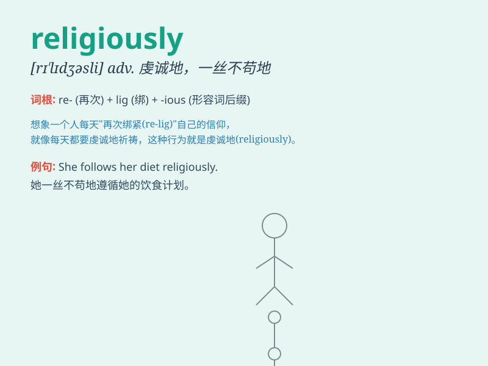

## religiously

**英音:** _[rɪˈlɪdʒəsli]_ **美音:** _[rɪˈlɪdʒəsli]_

**译义:** *adv.笃信地,虔敬地*

### 短语

+ **religiously observant:** _虔诚遵守宗教戒律的_

+ **religiously inclined:** _有宗教倾向的_

+ **religiously motivated:** _受宗教驱动的_

+ **religiously affiliated:** _宗教上有关联的_

+ **religiously inspired:** _受宗教启发的_

### 例句

#### 例句1

> **He attends church religiously every Sunday.**

**中文翻译:** 他每个星期天都虔诚地去教堂做礼拜。

**单词释义:** 虔诚地

#### 例句2

> **She follows her diet religiously to stay healthy.**

**中文翻译:** 为了保持健康，她严格遵循自己的饮食计划。

**单词释义:** 严格地

#### 例句3

> **They religiously observe the traditions of their ancestors.**

**中文翻译:** 他们虔诚地遵守祖先的传统。

**单词释义:** 虔诚地

### 背诵小故事

> Once upon a time, there was a monk who followed the religious rules
religiously. He prayed every day, never missed a single ceremony. His
devotion showed how one can act religiously, meaning with great devotion
and strictness.

**从前，有一个和尚严格遵循宗教规则。他每天祈祷，从未错过一次仪式。他的虔诚表明了一个人如何虔诚地行事，即非常投入和严格。**

### 图义

