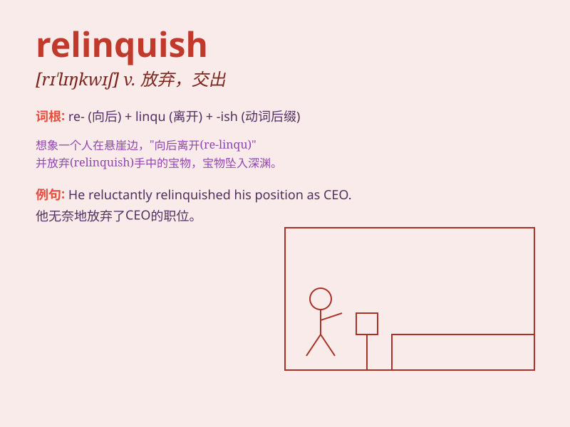

## relinquish

**英音:** _[rɪ\'lɪŋkwɪʃ]_ **美音:** _[rɪ\'lɪŋkwɪʃ]_

**译义:** *v.放弃*

### 短语

+ **relinquish control:** _放弃控制_

+ **relinquish power:** _放弃权力_

+ **relinquish possession:** _放弃占有_

+ **relinquish hope:** _放弃希望_

+ **relinquish responsibility:** _放弃责任_

### 例句

#### 例句1

> **He was forced to relinquish his position as CEO.**

**中文翻译:** 他被迫放弃首席执行官的职位。

**单词释义:** 放弃（职位、权力等）

#### 例句2

> **She finally relinquished her hold on the rope.**

**中文翻译:** 她终于松开了握着绳子的手。

**单词释义:** 松开，放开

#### 例句3

> **The thief was ordered to relinquish the stolen goods.**

**中文翻译:** 那个小偷被命令交出赃物。

**单词释义:** 交出，让出

### 背诵小故事

> A king was forced to relinquish his throne. He was very sad but had
no choice. Finally, he let go of the power and left the palace.

**一位国王被迫放弃他的王位。他非常伤心但别无选择。最终，他放下了权力离开了宫殿。**

### 图义

