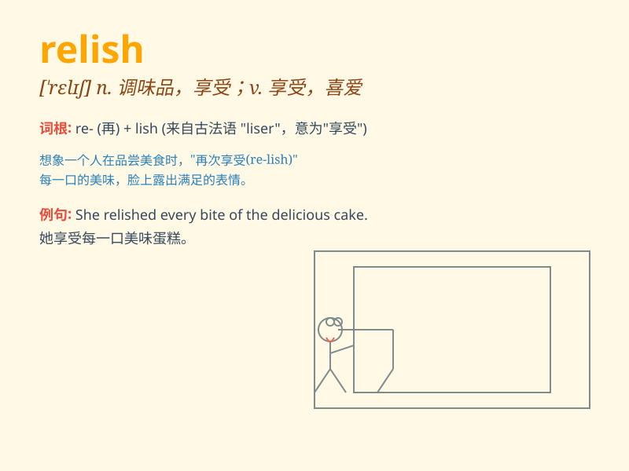

## relish

**英音:** _[\'relɪʃ]_ **美音:** _[\'rɛlɪʃ]_

**译义:** *n.意味*

### 短语

+ **relish the moment:** _享受当下_

+ **have no relish for:** _不喜欢；对\...没有兴趣_

+ **relish the challenge:** _喜欢挑战_

+ **with relish:** _津津有味地；有兴趣地_

+ **relish doing something:** _喜欢做某事_

### 例句

#### 例句1

> **I relish the opportunity to travel and explore new places.**

**中文翻译:** 我喜欢有旅行和探索新地方的机会。

**单词释义:** 喜欢；享受

#### 例句2

> **She relishes the challenge of solving difficult puzzles.**

**中文翻译:** 她享受解决难题的挑战。

**单词释义:** 享受；从\...获得乐趣

#### 例句3

> **He doesn\'t relish the thought of having to work overtime.**

**中文翻译:** 他可不喜欢得加班的想法。

**单词释义:** 喜欢；乐于

### 背诵小故事

> A hungry boy found a jar of relish in the kitchen. He tasted it and
loved the delicious flavor. From then on, whenever he saw relish, he
remembered that wonderful taste and felt happy.

**一个饥饿的男孩在厨房发现了一罐调味酱。他尝了尝，喜欢上了那美味的味道。从那以后，每当他看到调味酱，就会想起那美妙的滋味并感到开心。**

### 图义

