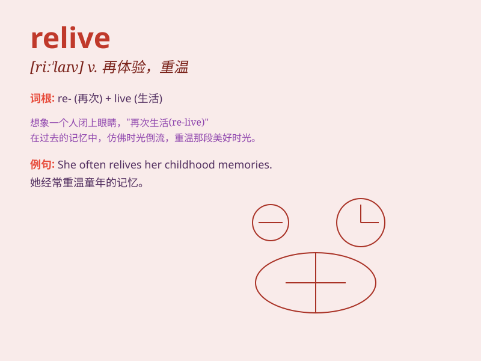

## relive

**英音:** _[riː\'lɪv]_ **美音:** _[,ri\'lɪv]_

**译义:** *vt.重新过活,再体验*

### 短语

+ **relive the past:** _重温过去_

+ **relive a memory:** _重温一段记忆_

+ **relive an experience:** _重新体验一次经历_

+ **relive a moment:** _重温一个时刻_

+ **relive history:** _重温历史_

### 例句

#### 例句1

> **She often relives her childhood memories when she looks at old
photos.**

**中文翻译:** 当她看老照片时，她经常重温她的童年记忆。

**单词释义:** 重温，再次体验

#### 例句2

> **He tried to relive the excitement of his first date with her.**

**中文翻译:** 他试图重新体验和她第一次约会时的兴奋。

**单词释义:** 重新经历，再次感受

#### 例句3

> **The veteran relived the horrors of war in his nightmares.**

**中文翻译:** 这位老兵在噩梦中重新经历了战争的恐怖。

**单词释义:** 再次经历（通常是不好的事情）

### 背诵小故事

> A man lost his favorite pet dog. But every time he looked at old
photos, he seemed to relive the happy moments with the dog. It means to
experience again the past.

**一个男人失去了他心爱的宠物狗。但每次他翻看旧照片时，他似乎都能重温与狗在一起的快乐时光。这个词的意思是再次体验过去。**

### 图义

