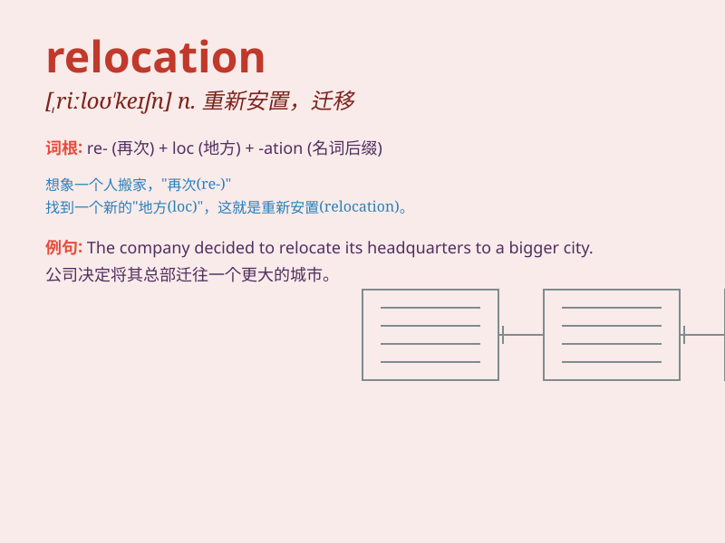

## relocation

**英音:** _[,riːləʊ\'keɪʃən]_ **美音:** _[rilo\'keʃən]_

**译义:** *n.再布置,变换布置*

### 短语

+ **job relocation:** _工作调动_

+ **relocation expenses:** _搬迁费用_

+ **forced relocation:** _强制迁移_

+ **relocation package:** _搬迁福利套餐_

+ **relocation assistance:** _搬迁援助_

### 例句

#### 例句1

> **The company\'s relocation to a new city brought many
challenges.**

**中文翻译:** 公司搬迁到一个新的城市带来了许多挑战。

**单词释义:** 搬迁

#### 例句2

> **Relocation of the refugees was organized by the government.**

**中文翻译:** 难民的重新安置是由政府组织的。

**单词释义:** 重新安置

#### 例句3

> **She is considering the relocation of her business to a larger
space.**

**中文翻译:** 她正在考虑把她的生意搬迁到一个更大的地方。

**单词释义:** 搬迁

### 背诵小故事

> A family\'s relocation adventure began. They had to leave their old
home and move to a new city. It was hard but they were full of hope for
a better life. The process of this move is called relocation.

**一个家庭的搬迁冒险开始了。他们不得不离开旧家，搬到一个新的城市。这很艰难，但他们对更好的生活充满希望。这个搬家的过程就叫做relocation。**

### 图义

