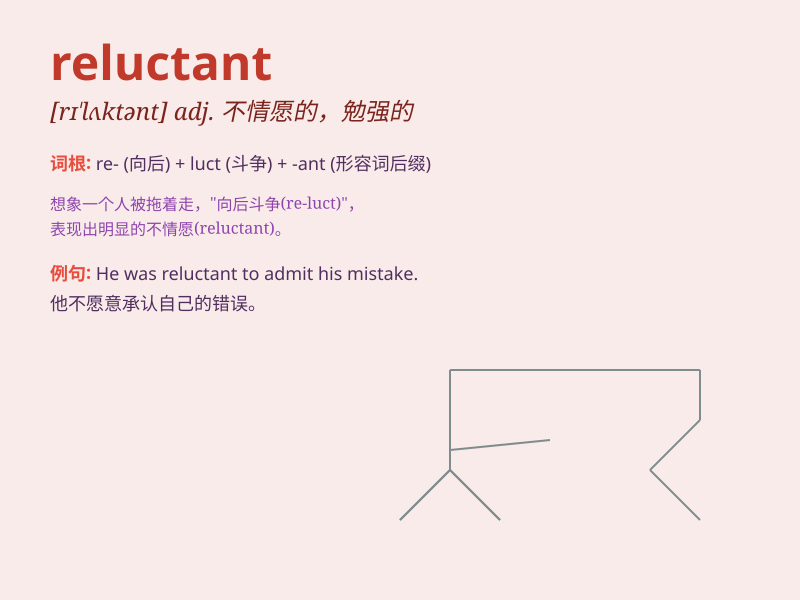

## reluctant

**英音:** _[rɪ\'lʌkt(ə)nt]_ **美音:** _[rɪ\'lʌktənt]_

**译义:** *adj.不顾的,勉强的,难得到的,难处理的*

### 短语

+ **be reluctant to do sth:** _不情愿做某事_

+ **reluctant agreement:** _勉强的同意_

+ **reluctant smile:** _勉强的微笑_

+ **reluctant acceptance:** _不情愿的接受_

+ **reluctant departure:** _不情愿的离开_

### 例句

#### 例句1

> **He was reluctant to admit his mistake.**

**中文翻译:** 他不愿意承认他的错误。

**单词释义:** 不愿意

#### 例句2

> **She seemed reluctant to go with us.**

**中文翻译:** 她似乎不愿意和我们一起去。

**单词释义:** 不愿意

#### 例句3

> **The company was reluctant to invest in new technology.**

**中文翻译:** 这家公司不愿意投资新技术。

**单词释义:** 不愿意

### 背诵小故事

> A little rabbit was reluctant to go to school. Every morning, it
dragged its feet and whined. But when it made friends and learned fun
things, it became less reluctant. Remember, reluctant means being
unwilling or hesitant!

**一只小兔子很不情愿去上学。每天早上，它都拖拖拉拉，还抱怨。但当它交到朋友并学到有趣的东西后，就不那么不情愿了。记住，reluctant
意思是不情愿或犹豫！**

### 图义

