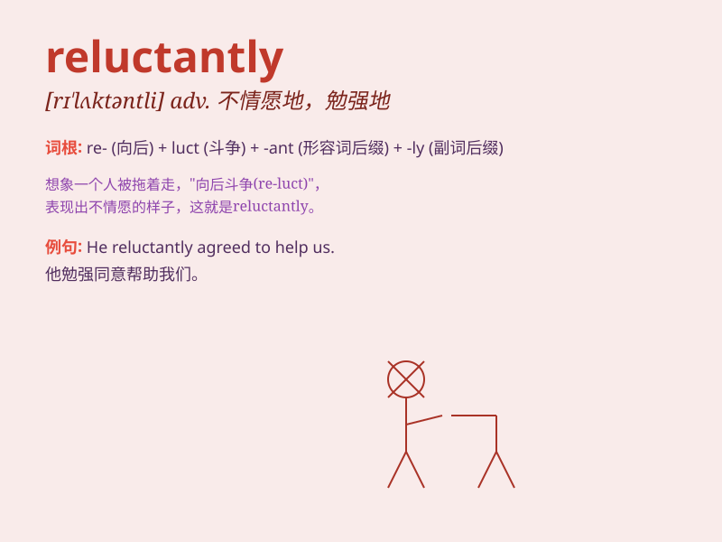

## reluctantly

**英音:** _[rɪ\'lʌktəntlɪ]_ **美音:** _[rɪ\'lʌktəntli]_

**译义:** *adv.不情愿地,嫌恶地*

### 短语

+ **reluctantly agree:** _不情愿地同意_

+ **reluctantly admit:** _不情愿地承认_

+ **reluctantly follow:** _不情愿地跟随_

+ **reluctantly leave:** _不情愿地离开_

+ **reluctantly accept:** _不情愿地接受_

### 例句

#### 例句1

> **He reluctantly agreed to help me. **

**中文翻译:** 他很不情愿地同意帮助我。

**单词释义:** 不情愿地

#### 例句2

> **She left the party reluctantly. **

**中文翻译:** 她不情愿地离开了聚会。

**单词释义:** 不情愿地

#### 例句3

> **They reluctantly accepted the new terms. **

**中文翻译:** 他们很不情愿地接受了新条款。

**单词释义:** 不情愿地

### 背诵小故事

> A little rabbit was reluctant to leave its warm home to go foraging.
It hesitated and moved reluctantly. But finally, hunger pushed it out.
\'Reluctantly\' means doing something unwillingly.

**一只小兔子很不情愿离开它温暖的家去觅食。它犹豫着，动作迟缓。但最终，饥饿迫使它出去了。\'reluctantly\'意思是不情愿地做某事。**

### 图义

