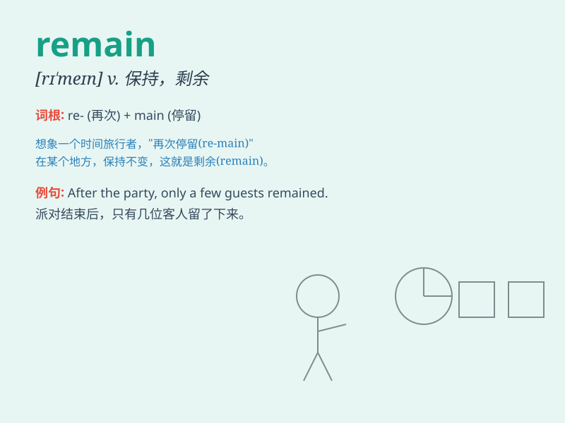

## remain

**英音:** _[rɪ\'meɪn]_ **美音:** _[rɪ\'men]_

**译义:** *vi.保持,逗留,剩余,残存*

### 短语

+ **remain silent:** _保持沉默_

+ **remain calm:** _保持冷静_

+ **remain standing:** _一直站着_

+ **remain unchanged:** _保持不变_

+ **remain in contact:** _保持联系_

### 例句

#### 例句1

> **The problem remains unsolved.**

**中文翻译:** 这个问题仍然未被解决。

**单词释义:** 依然是，仍然处于（某种状态）

#### 例句2

> **After the fire, very little remained of the house.**

**中文翻译:** 火灾过后，这座房子所剩无几。

**单词释义:** 剩余，遗留

#### 例句3

> **He remained silent throughout the meeting.**

**中文翻译:** 在整个会议期间他保持沉默。

**单词释义:** 保持，维持

### 背诵小故事

> A brave knight was in a battle. After the fierce fight, many left the
field, but the knight remained, standing firm to protect his land. He
remained because of his duty and love for his home.

**一位勇敢的骑士在一场战斗中。经过激烈的战斗，许多人离开了战场，但这位骑士留了下来，坚定地站着保卫他的土地。他留下来是因为他的职责和对家园的爱。**

### 图义

