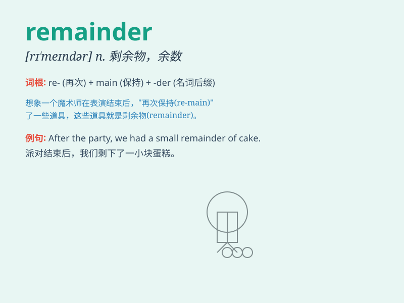

## remainder

**英音:** _[rɪ\'meɪndə]_ **美音:** _[rɪ\'mendɚ]_

**译义:**
*n.残余,剩余物,其他的人,[数]余数v.廉价出售adj.剩余的,出售剩书的*

### 短语

+ **remainder theorem:** _余数定理_

+ **remainder term:** _余项_

+ **sell at remainder:** _廉价出售_

+ **remainder of the year:** _本年度剩余时间_

+ **in the remainder:** _在其余部分_

### 例句

#### 例句1

> **The remainder of the cake was eaten by my sister.**

**中文翻译:** 蛋糕的剩余部分被我妹妹吃了。

**单词释义:** 剩余部分

#### 例句2

> **After subtraction, the remainder is 5.**

**中文翻译:** 减法运算后，余数是 5。

**单词释义:** 余数

#### 例句3

> **He spent the remainder of his life in peace.**

**中文翻译:** 他在平静中度过了余生。

**单词释义:** 剩余的时间

### 背诵小故事

> A king divided his treasures among his sons. After the distribution,
there was still a small part left. This left part was the remainder. It
was like the forgotten pieces waiting to be noticed.

**一位国王把他的财宝分给儿子们。分完之后，仍然有一小部分剩余。这剩下的部分就是余数。它就像被遗忘的部分等待被注意到。**

### 图义

