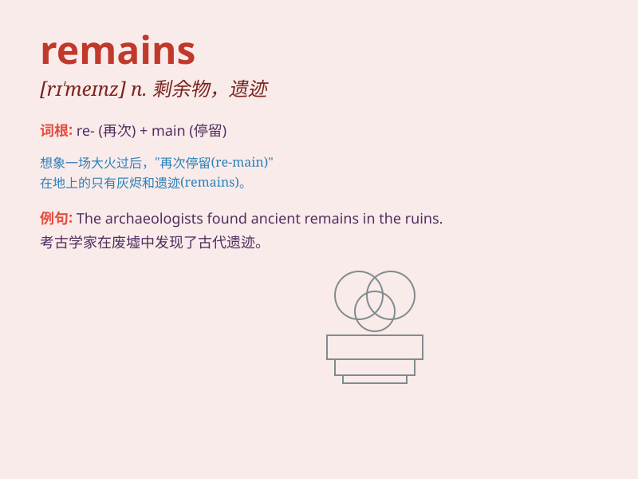

## remains

**英音:** _[rɪ\'meɪnz]_ **美音:** _[rɪ\'menz]_

**译义:** *n.残余,遗迹,遗体*

### 短语

+ **human remains:** _人体残骸_

+ **animal remains:** _动物遗骸_

+ **historical remains:** _历史遗迹_

+ **archaeological remains:** _考古遗迹_

+ **the remains of a meal:** _一餐的剩饭_

### 例句

#### 例句1

> **The remains of the ancient building are still visible.**

**中文翻译:** 这座古建筑的遗迹仍然可见。

**单词释义:** 遗迹；残余部分

#### 例句2

> **His remains were buried in the local cemetery.**

**中文翻译:** 他的遗体被埋葬在当地的公墓里。

**单词释义:** 遗体

#### 例句3

> **The remains of the meal were cleared away.**

**中文翻译:** 这顿饭剩下的东西被清理掉了。

**单词释义:** 剩余物

### 背诵小故事

> A brave archaeologist found some ancient remains in a hidden cave.
They were like clues to a lost civilization. These remains told stories
of the past and sparked his curiosity.

**一位勇敢的考古学家在一个隐蔽的洞穴中发现了一些古代遗迹。它们就像是失落文明的线索。这些遗迹讲述着过去的故事，并激发了他的好奇心。**

### 图义

