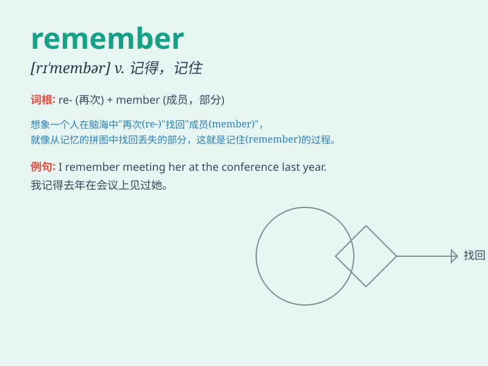

## remember

**英音:** _[rɪ\'membə]_ **美音:** _[rɪ\'mɛmbɚ]_

**译义:** *vt.回忆起,铭记,纪念vi.记得*

### 短语

+ **remember to do sth:** _记得去做某事_

+ **remember doing sth:** _记得做过某事_

+ **remember me to sb:** _代我向某人问好_

+ **remember one\'s words:** _记住某人的话_

+ **remember the past:** _记住过去_

### 例句

#### 例句1

> **I still remember the day we met.**

**中文翻译:** 我仍然记得我们相遇的那一天。

**单词释义:** 记得

#### 例句2

> **Remember to lock the door before you leave.**

**中文翻译:** 在你离开之前记得锁门。

**单词释义:** 记得

#### 例句3

> **She always remembers her friends\' birthdays.**

**中文翻译:** 她总是记得她朋友们的生日。

**单词释义:** 记得

### 背诵小故事

> One day, I lost my favorite book. I was very sad. But then I
remembered where I put it. It was under the bed. I was so happy to find
it. Remembering can bring back good things.

**有一天，我弄丢了我最喜欢的书。我非常伤心。但随后我记起来我把它放哪儿了。它在床底下。能找到它我太开心了。记住能找回美好的东西。**

### 图义

