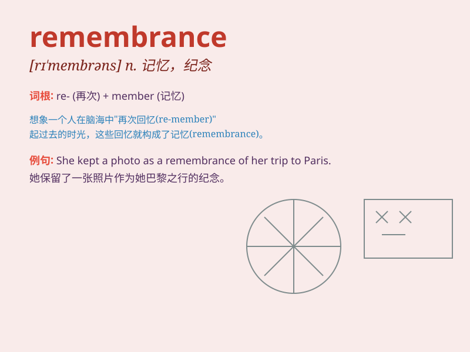

## remembrance

**英音:** _[rɪ\'membr(ə)ns]_ **美音:** _[rɪ\'mɛmbrəns]_

**译义:** *n.回想,记忆,问候,纪念品,记忆力*

### 短语

+ **in remembrance of:** _作为对......的纪念_

+ **remembrance day:** _（英）荣军纪念日_

+ **living remembrance:** _活的纪念_

+ **sweet remembrance:** _甜蜜的回忆_

+ **fond remembrance:** _深情的怀念_

### 例句

#### 例句1

> **The old photo brought back remembrances of my childhood.**

**中文翻译:** 这张老照片唤起了我对童年的回忆。

**单词释义:** 回忆；记忆

#### 例句2

> **She has only vague remembrances of her grandfather.**

**中文翻译:** 她对她祖父只有模糊的记忆。

**单词释义:** 记忆；回想

#### 例句3

> **In remembrance of our dear friend, we planted a tree.**

**中文翻译:** 为了纪念我们亲爱的朋友，我们种了一棵树。

**单词释义:** 纪念；怀念

### 背诵小故事

> One day, a little girl found an old diary while cleaning the attic.
It was filled with remembrances of her grandmother\'s childhood. The
diary became a precious link to the past, making the girl understand the
meaning of remembrance.

**有一天，一个小女孩在打扫阁楼时发现了一本旧日记。里面充满了她祖母童年的回忆。这本日记成为了与过去的珍贵连接，让小女孩明白了
remembrance（回忆、记忆）的意义。**

### 图义

