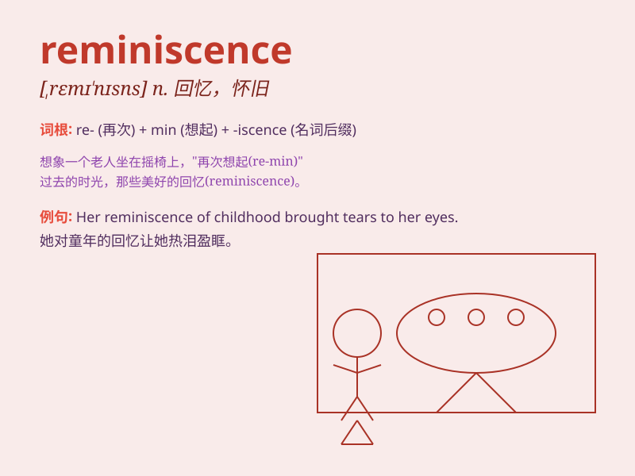

## reminiscence

**英音:** _[remɪ\'nɪs(ə)ns]_ **美音:** _[\'rɛmə\'nɪsns]_

**译义:** *n.回想,记忆力,怀旧*

### 短语

+ **fond reminiscence:** _美好的回忆_

+ **reminiscence therapy:** _回忆疗法_

+ **childhood reminiscence:** _童年回忆_

+ **reminiscence of the past:** _对过去的回忆_

+ **sweet reminiscence:** _甜蜜的回忆_

### 例句

#### 例句1

> **The old photo brought back reminiscences of my childhood.**

**中文翻译:** 这张老照片唤起了我童年的回忆。

**单词释义:** 回忆；怀旧

#### 例句2

> **She shared some reminiscences of her time in Paris.**

**中文翻译:** 她分享了一些她在巴黎时的回忆。

**单词释义:** 回忆；追忆

#### 例句3

> **His reminiscences were filled with joy and sadness.**

**中文翻译:** 他的回忆充满了欢乐和悲伤。

**单词释义:** 回忆往事

### 背诵小故事

> One day, while looking at old photos, I had a flood of reminiscence.
I recalled the fun times at the beach with friends, the laughter and
joy. Those memories are like precious jewels.

**有一天，当我看着旧照片时，涌起了大量的回忆。我想起了和朋友们在海滩的欢乐时光，那些欢声笑语。这些记忆就像珍贵的珠宝。**

### 图义

