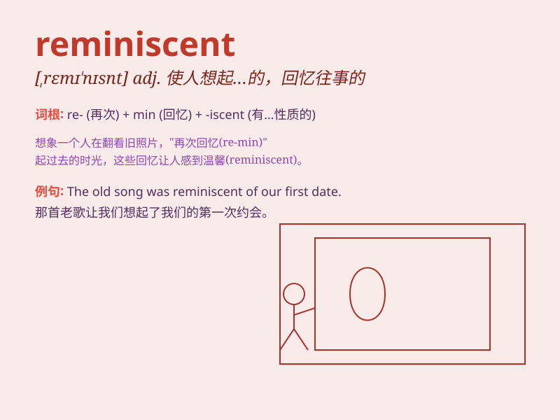

## reminiscent

**英音:** _[remɪ\'nɪs(ə)nt]_ **美音:** _[,rɛmɪ\'nɪsnt]_

**译义:** *adj.回忆往事的*

### 短语

+ **reminiscent of:** _使人想起；令人回忆起_

+ **be reminiscent:** _是怀旧的；使人缅怀的_

+ **reminiscent mood:** _怀旧的情绪_

+ **reminiscent feeling:** _怀旧的感觉_

+ **reminiscent story:** _怀旧的故事_

### 例句

#### 例句1

> **The old house was reminiscent of my childhood.**

**中文翻译:** 这座老房子让我想起了我的童年。

**单词释义:** 使想起，勾起回忆

#### 例句2

> **Her style of dress is reminiscent of the 1960s.**

**中文翻译:** 她的着装风格让人想起 20 世纪 60 年代。

**单词释义:** 让人想起，使人联想到

#### 例句3

> **The music was reminiscent of a warm summer night.**

**中文翻译:** 这音乐让人回想起一个温暖的夏夜。

**单词释义:** 使人想起，令人回忆起

### 背诵小故事

> A man was walking in an old town, seeing the familiar houses and
streets. It made him reminiscent of his childhood. The scenes triggered
memories of playing with friends and having fun. He felt a warm sense of
nostalgia.

**一个男人在一个古老的城镇里散步，看到熟悉的房屋和街道。这让他想起了童年。这些场景勾起了他和朋友们玩耍以及快乐的回忆。他感到一种温暖的怀旧之情。**

### 图义

