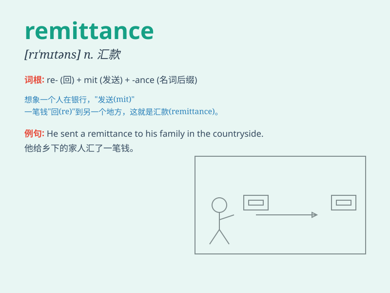

## remittance

**英音:** _[rɪ\'mɪt(ə)ns]_ **美音:** _[rɪ\'mɪtns]_

**译义:** *n.汇款,汇寄之款,汇款额*

### 短语

+ **remittance advice:** _汇款通知_

+ **remittance slip:** _汇款凭单_

+ **international remittance:** _国际汇款_

+ **bank remittance:** _银行汇款_

+ **electronic remittance:** _电子汇款_

### 例句

#### 例句1

> **I received a remittance from my friend abroad.**

**中文翻译:** 我收到了我国外朋友的汇款。

**单词释义:** 汇款

#### 例句2

> **The remittance was sent to support his family.**

**中文翻译:** 这笔汇款是为了支持他的家庭而寄的。

**单词释义:** 汇款

#### 例句3

> **Please provide the details for the remittance.**

**中文翻译:** 请提供汇款的详细信息。

**单词释义:** 汇款

### 背诵小故事

> A man was in a foreign country and needed money. His family sent him
a remittance. It was like a lifeline, allowing him to solve his
financial problem and feel the warmth of home.

**一个男人在国外，急需用钱。他的家人给他寄了一笔汇款。这就像一条生命线，让他解决了财务问题，感受到了家的温暖。**

### 图义

