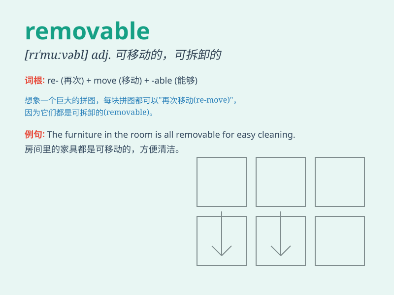

## removable

**英音:** _[rɪ\'muːvəbl]_ **美音:** _[rɪ\'muvəbl]_

**译义:** *adj.抽取式的,可移动的*

### 短语

+ **removable disk:** _可移动磁盘_

+ **removable media:** _可移动媒体_

+ **removable storage:** _可移动存储_

+ **removable part:** _可拆除部分_

+ **removable cover:** _可移动的盖子_

### 例句

#### 例句1

> **The battery of this laptop is removable.**

**中文翻译:** 这台笔记本电脑的电池是可拆卸的。

**单词释义:** 可拆卸的

#### 例句2

> **The removable cover of the sofa is easy to clean.**

**中文翻译:** 沙发的可拆卸套子容易清洗。

**单词释义:** 可拆卸的

#### 例句3

> **This stain is removable with special detergent.**

**中文翻译:** 用特殊的洗涤剂可以去除这个污渍。

**单词释义:** 可去除的

### 背诵小故事

> One day, I found a strange device with a removable part. I took it
off easily and discovered its secret. The removable part was the key to
solving the mystery!

**有一天，我发现了一个带有可移除部件的奇怪装置。我轻松地把它取下来，发现了它的秘密。这个可移除的部件是解开谜团的关键！**

### 图义

