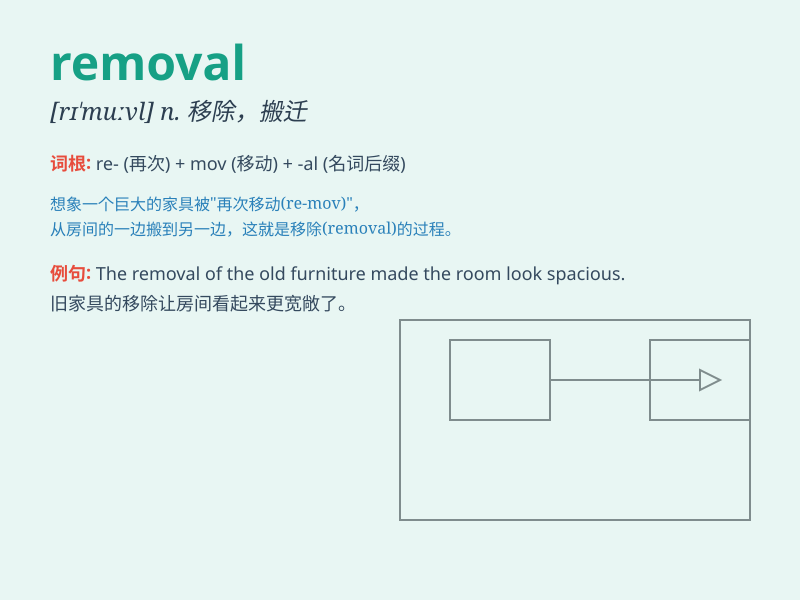

## removal

**英音:** _[rɪ\'muːv(ə)l]_ **美音:** _[rɪ\'muvl]_

**译义:** *n.移动,免职,切除*

### 短语

+ **removal company:** _搬运公司_

+ **removal van:** _搬运车_

+ **hair removal:** _脱毛_

+ **dust removal:** _除尘_

+ **waste removal:** _废物清除_

### 例句

#### 例句1

> **The removal of the old furniture was a difficult task.**

**中文翻译:** 搬走这些旧家具是一项艰巨的任务。

**单词释义:** 搬走；移走

#### 例句2

> **He underwent a removal of his appendix last week.**

**中文翻译:** 他上周做了阑尾切除手术。

**单词释义:** 切除；去除

#### 例句3

> **The removal of the stains required a special detergent.**

**中文翻译:** 去除这些污渍需要一种特殊的洗涤剂。

**单词释义:** 去除；消除

### 背诵小故事

> A king ordered the removal of all the old furniture from the palace.
Workers came and carried them away. The action of taking away those
furniture is called removal.

**一位国王下令把宫殿里所有旧家具都搬走。工人们来了并把它们运走。这种搬走的行为就叫做
removal。**

### 图义

