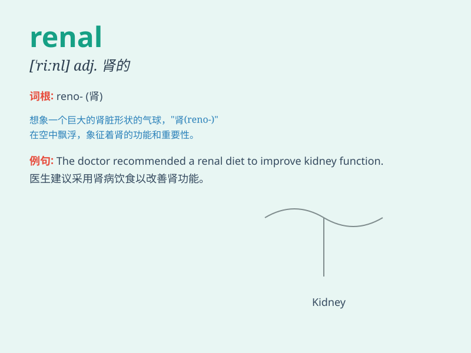

## renal

**英音:** _[\'riːn(ə)l]_ **美音:** _[\'rinl]_

**译义:** *adj.肾脏的,肾的*

### 短语

+ **renal failure:** _肾衰竭_

+ **renal artery:** _肾动脉_

+ **renal function:** _肾功能_

+ **renal calculus:** _肾结石_

+ **renal transplant:** _肾移植_

### 例句

#### 例句1

> **The patient has a severe renal disorder.**

**中文翻译:** 这位病人患有严重的肾脏疾病。

**单词释义:** 肾脏的

#### 例句2

> **Renal failure can be a life-threatening condition.**

**中文翻译:** 肾衰竭可能是一种危及生命的状况。

**单词释义:** 肾脏的

#### 例句3

> **The doctor specializes in renal medicine.**

**中文翻译:** 这位医生专攻肾脏医学。

**单词释义:** 肾脏的

### 背诵小故事

> A doctor was treating a patient with renal problems. The patient\'s
kidneys, or \'renal organs\', weren\'t working well. The doctor worked
hard to fix the renal function and make the patient healthy again.

**一位医生正在治疗一位有肾脏问题的病人。病人的肾脏，即"renal
器官"，运转不佳。医生努力修复肾脏功能，让病人再次恢复健康。**

### 图义

