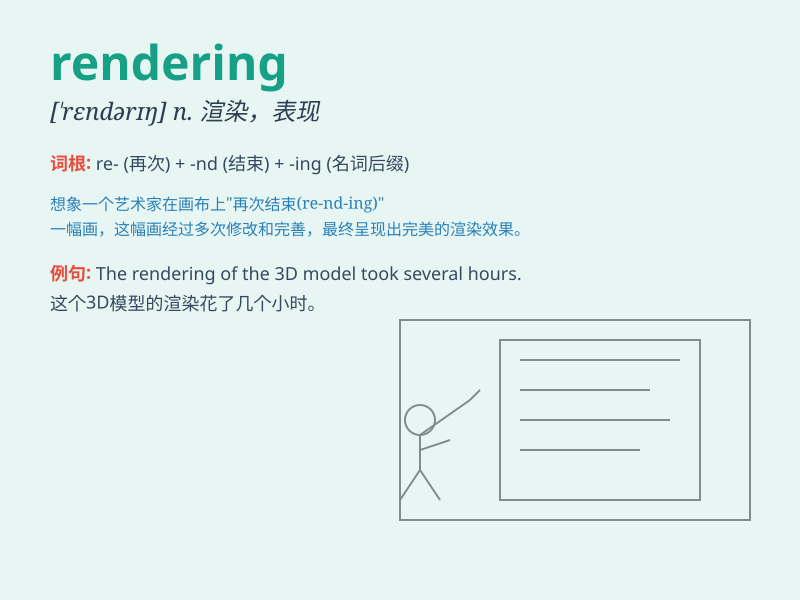

## rendering

**英音:** _[\'rend(ə)rɪŋ]_ **美音:** _[\'rɛndərɪŋ]_

**译义:** *n.翻译,表现,描写,透视图,粉刷,表演,打底,复制图*

### 短语

+ **image rendering:** _图像渲染_

+ **3D rendering:** _三维渲染_

+ **rendering service:** _渲染服务_

+ **rendering engine:** _渲染引擎_

+ **real-time rendering:** _实时渲染_

### 例句

#### 例句1

> **The artist\'s rendering of the landscape was breathtaking.**

**中文翻译:** 这位艺术家对这片风景的描绘令人惊叹。

**单词释义:** 描绘；描写

#### 例句2

> **The new software provides a high-quality rendering of 3D
images.**

**中文翻译:** 新软件提供了高质量的 3D 图像渲染。

**单词释义:** （计算机）渲染

#### 例句3

> **The translation is a poor rendering of the original text.**

**中文翻译:** 这个翻译对原文的呈现很糟糕。

**单词释义:** 呈现；表现

### 背诵小故事

> A painter was working hard on a rendering of a beautiful landscape.
He spent hours perfecting every detail to present a vivid and charming
scene. Finally, his rendering was highly praised.

**一位画家正在努力创作一幅美丽风景的效果图。他花了几个小时完善每一个细节，以呈现出生动迷人的场景。最终，他的效果图受到了高度赞扬。**

### 图义

