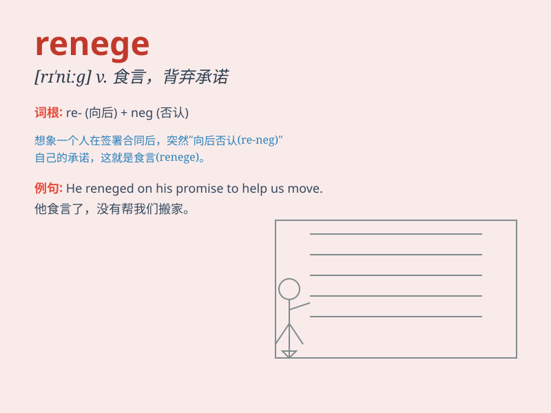

## renege

**英音:** _[rɪ\'neɪg; rɪ\'niːg]_ **美音:** _[rɪ\'niɡ]_

**译义:** *vi.食言,违例出牌vt.否认,拒绝n.出牌违例*

### 短语

+ **renege on:** _违背；违约_

+ **renege a promise:** _违背诺言_

+ **renege an agreement:** _违反协议_

+ **renege commitment:** _背弃承诺_

+ **renege obligation:** _不履行义务_

### 例句

#### 例句1

> **He reneged on his promise to help me.**

**中文翻译:** 他违背了帮助我的承诺。

**单词释义:** 违背；背信

#### 例句2

> **The company reneged on the contract at the last minute.**

**中文翻译:** 这家公司在最后一刻违背了合同。

**单词释义:** 违约；食言

#### 例句3

> **Don\'t renege on your word once you give it.**

**中文翻译:** 一旦你做出承诺，就不要食言。

**单词释义:** 背约；反悔

### 背诵小故事

> A knight promised to protect the village but renege on his word when
the enemy came. The villagers were angry and shouted, \'You renege! You
broke your promise!\'

**一位骑士承诺保护村庄，但当敌人来时却违背了他的诺言。村民们很生气，大喊道：'你违背诺言！你食言了！'**

### 图义

