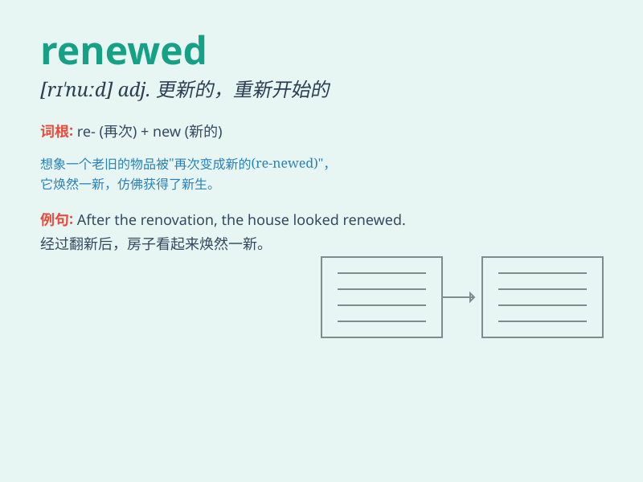

## renewed

**英音:** _[rɪ\'njuːd]_ **美音:** _[rɪ\'nud]_

**译义:** *adj.更新的,重建的,复兴的,重申的*

### 短语

+ **renewed interest:** _重新产生的兴趣_

+ **renewed energy:** _恢复的精力_

+ **renewed hope:** _重新燃起的希望_

+ **renewed strength:** _恢复的力量_

+ **renewed commitment:** _重新作出的承诺_

### 例句

#### 例句1

> **The company has a renewed focus on customer service.**

**中文翻译:** 这家公司重新将重点放在了客户服务上。

**单词释义:** 重新的；更新的

#### 例句2

> **She felt renewed energy after a good night\'s sleep.**

**中文翻译:** 她在睡了一个好觉后感到精力重新恢复了。

**单词释义:** 重新获得的

#### 例句3

> **The renewed interest in traditional culture is encouraging.**

**中文翻译:** 对传统文化重新产生的兴趣令人鼓舞。

**单词释义:** 重新产生的

### 背诵小故事

> A tired old house was given a new chance. Workers came and renewed
everything - the floors, the walls, and the roof. Now it\'s like a
brand-new home. The word \'renewed\' means made new again.

**一座疲惫的老房子获得了新的机会。工人们来了，把所有东西都更新了------地板、墙壁和屋顶。现在它就像一个全新的家。单词\'renewed\'意思是重新变新。**

### 图义

