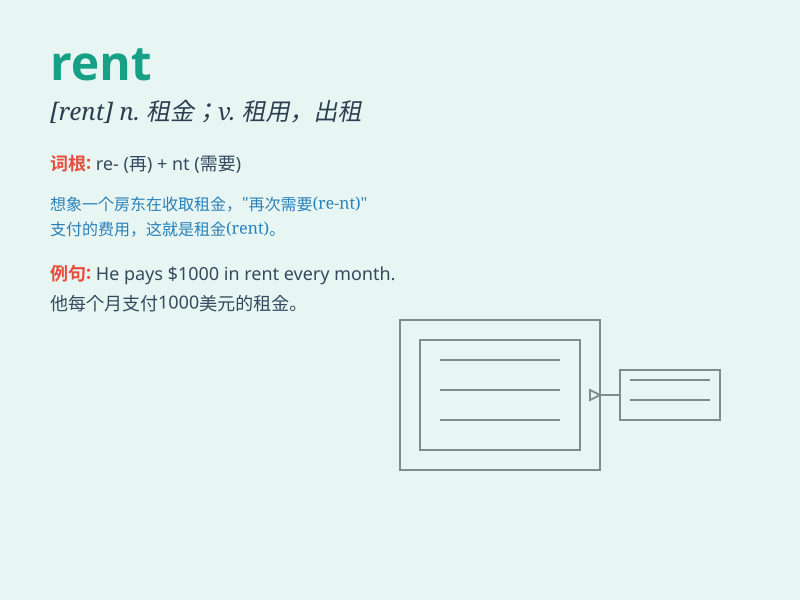

## rent

**英音:** _[rent]_ **美音:** _[rɛnt]_

**译义:** *v.租,租借,出租n.租金*

### 短语

+ **for rent:** _供出租；出租的_

+ **rent out:** _出租；租出_

+ **pay the rent:** _付租金_

+ **monthly rent:** _月租金_

+ **high rent:** _高额租金_

### 例句

#### 例句1

> **I rent an apartment in the city center.**

**中文翻译:** 我在市中心租了一套公寓。

**单词释义:** 租用

#### 例句2

> **They decided to rent out their spare room.**

**中文翻译:** 他们决定把闲置的房间出租出去。

**单词释义:** 出租

#### 例句3

> **The rent for this house is very high.**

**中文翻译:** 这所房子的租金非常高。

**单词释义:** 租金

### 背诵小故事

> A poor student needed a place to live. He found a small room and had
to pay rent every month. But he worked hard and finally saved enough
money to buy his own house.

**一个贫困的学生需要一个住的地方。他找了一个小房间并且每个月都得付租金。但他努力工作，最终攒够了钱买了自己的房子。**

### 图义

