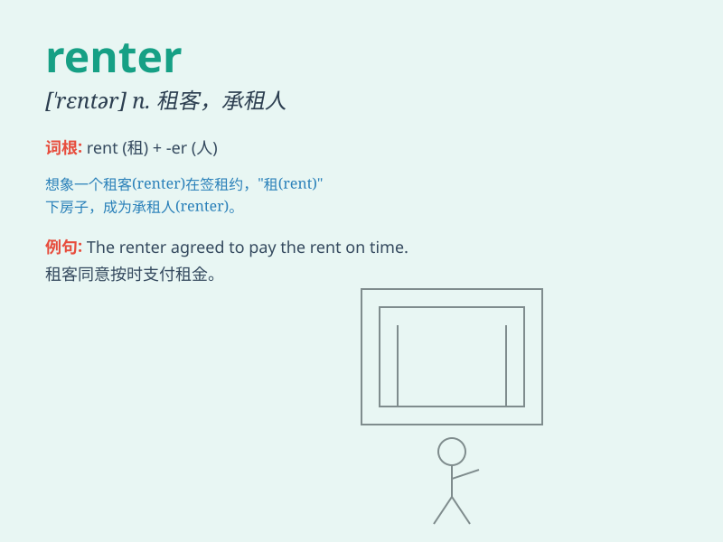

## renter

**英音:** _[\'rentə]_ **美音:** _[\'rɛntɚ]_

**译义:** *n.租贷人*

### 短语

+ **long-term renter:** _长期租户_

+ **monthly renter:** _按月租房者_

+ **prime renter:** _优质租户_

+ **commercial renter:** _商业租户_

+ **potential renter:** _潜在租户_

### 例句

#### 例句1

> **The renter signed a one-year lease for the apartment.**

**中文翻译:** 租客签署了公寓的一年租约。

**单词释义:** 租客

#### 例句2

> **The landlord had some issues with the renter\'s late
payments.**

**中文翻译:** 房东对租客的延迟付款有些问题。

**单词释义:** 租客

#### 例句3

> **She became a renter after selling her house.**

**中文翻译:** 她卖了房子后成为了一名租客。

**单词释义:** 租客

### 背诵小故事

> One day, Tom needed a new place to live. So, he became a renter and
found a nice apartment. The landlord was friendly and they signed the
contract. Now Tom was a happy renter with a cozy home.

**一天，汤姆需要一个新的住处。于是，他成为了一个租客，找到了一个不错的公寓。房东很友好，他们签了合同。现在汤姆是一个拥有舒适家的快乐租客。**

### 图义

