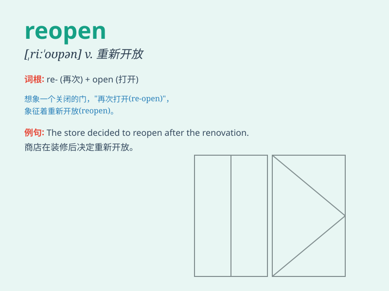

## reopen

**英音:** _[riː\'əʊp(ə)n]_ **美音:** _[,ri\'opən]_

**译义:** *v.重开,再开始*

### 短语

+ **reopen a case:** _重新审理案件_

+ **reopen a debate:** _重新展开辩论_

+ **reopen a wound:** _重新揭开伤口_

+ **reopen a shop:** _重新开店_

+ **reopen negotiations:** _重新进行谈判_

### 例句

#### 例句1

> **The school will reopen next week.**

**中文翻译:** 学校将于下周重新开放。

**单词释义:** 重新开放

#### 例句2

> **The case was reopened after new evidence emerged.**

**中文翻译:** 在新证据出现后，这个案子被重新审理。

**单词释义:** 重新开始；重新处理

#### 例句3

> **The store has reopened with a new look.**

**中文翻译:** 这家商店以新的面貌重新开业了。

**单词释义:** 重新开业

### 背诵小故事

> The small café had to close due to a storm. But when the weather
improved, it was able to REOPEN and welcome customers again. People were
happy to see their favorite place back in business.

**这家小咖啡馆因暴风雨不得不关闭。但当天气好转时，它得以重新开业并再次欢迎顾客。人们很高兴看到他们最喜欢的地方恢复营业。**

### 图义

