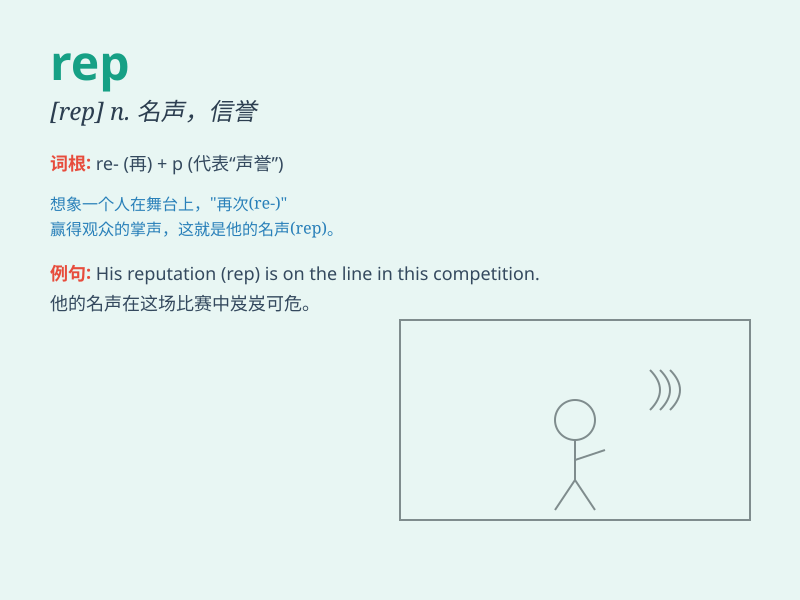

## rep

**英音:** _[rep]_ **美音:** _[rɛp]_

**译义:** *n.棱纹平布*

### 短语

+ **sales rep:** _销售代表_

+ **customer rep:** _客户代表_

+ **service rep:** _服务代表_

+ **republican rep:** _共和党代表_

+ **house rep:** _众议院代表_

### 例句

#### 例句1

> **He\'s a sales rep for a computer company.**

**中文翻译:** 他是一家计算机公司的销售代表。

**单词释义:** 代表；推销员

#### 例句2

> **The rep of the new product was very successful.**

**中文翻译:** 新产品的推广非常成功。

**单词释义:** 推广；宣传

#### 例句3

> **I need to speak to your rep about the contract.**

**中文翻译:** 我需要和你们的代表谈谈合同的事。

**单词释义:** 代表

### 背诵小故事

> A sales rep was constantly on the road, representing the company. One
day, he lost his rep as the best salesperson due to a mistake. But he
worked hard to regain his good rep.

**一位销售代表总是在路上，代表着公司。有一天，他因为一个错误失去了作为最佳销售人员的声誉。但他努力工作以重获良好的声誉。**

### 图义

