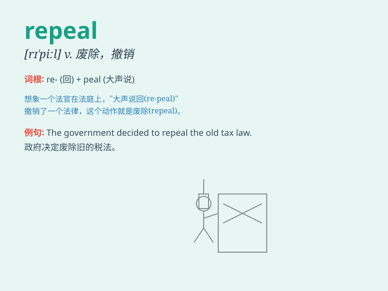

## repeal

**英音:** _[rɪ\'piːl]_ **美音:** _[rɪ\'pil]_

**译义:** *v.废止,撤销,否定,放弃,废除n.废除,撤销*

### 短语

+ **repeal a law:** _废除一项法律_

+ **repeal an act:** _废止一项法令_

+ **repeal a regulation:** _撤销一项规定_

+ **repeal a ban:** _解除一项禁令_

+ **repeal a decree:** _废除一项政令_

### 例句

#### 例句1

> **The government is considering the repeal of the controversial
law.**

**中文翻译:** 政府正在考虑废除这项有争议的法律。

**单词释义:** 废除

#### 例句2

> **The new president promised to repeal the old tax policy.**

**中文翻译:** 新总统承诺废除旧的税收政策。

**单词释义:** 废除

#### 例句3

> **They are working hard to achieve the repeal of the unfair
regulations.**

**中文翻译:** 他们正在努力争取废除不公平的规定。

**单词释义:** 废除

### 背诵小故事

> A king issued a law that caused great suffering. The people were very
angry. Finally, they demanded the repeal of this law. The king agreed
and the bad law was abolished.

**一位国王颁布了一项造成巨大痛苦的法律。民众非常愤怒。最终，他们要求废除这条法律。国王同意了，这条糟糕的法律被废止了。**

### 图义

