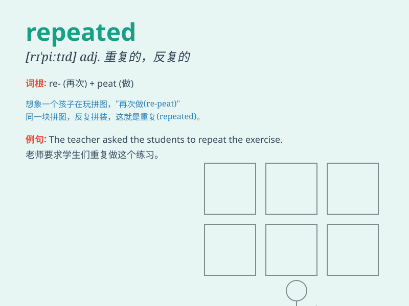

## repeated

**英音:** _[rɪˈpiːtɪd]_ **美音:** _[rɪˈpiːtɪd]_

**译义:** *adj.重复的,再三的*

### 短语

+ **repeated attempts:** _多次尝试_

+ **repeated failures:** _屡次失败_

+ **repeated warnings:** _再三警告_

+ **repeated calls:** _反复呼叫_

+ **repeated questions:** _重复的问题_

### 例句

#### 例句1

> **She received repeated warnings about the danger.**

**中文翻译:** 她多次收到有关危险的警告。

**单词释义:** 多次的；反复的

#### 例句2

> **The doctor recommended repeated doses of the medicine.**

**中文翻译:** 医生建议重复用药剂量。

**单词释义:** 重复的

#### 例句3

> **His repeated attempts to pass the exam finally paid off.**

**中文翻译:** 他多次尝试通过考试，最终成功了。

**单词释义:** 反复的

### 背诵小故事

> A little monkey climbed the tree. But it fell down and repeated this
action many times. Finally, it learned how to climb safely. \'Repeated\'
means doing something again and again.

**一只小猴子爬树。但它掉了下来，并多次重复这个动作。最后，它学会了如何安全攀爬。'repeated'意思是反复地做某事。**

### 图义

