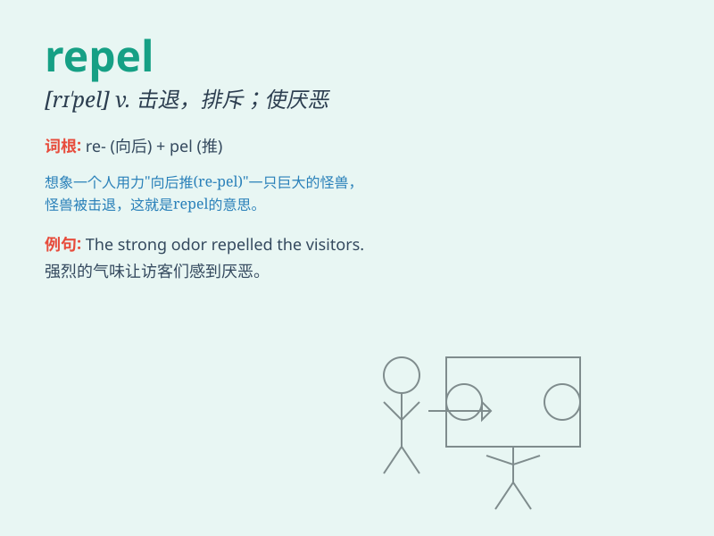

## repel

**英音:** _[rɪ\'pel]_ **美音:** _[rɪ\'pɛl]_

**译义:** *vt.击退,抵制,使厌恶,使不愉快*

### 短语

+ **repel an attack:** _击退攻击_

+ **repel temptation:** _抵制诱惑_

+ **repel insects:** _驱除昆虫_

+ **repel invaders:** _击退侵略者_

+ **repel moisture:** _防潮_

### 例句

#### 例句1

> **The magnet repels the iron nail.**

**中文翻译:** 这块磁铁排斥铁钉。

**单词释义:** 排斥

#### 例句2

> **His bad manners repel everyone.**

**中文翻译:** 他的不礼貌举止令每个人都反感。

**单词释义:** 使反感

#### 例句3

> **The army was ready to repel the invaders.**

**中文翻译:** 军队准备击退侵略者。

**单词释义:** 击退

### 背诵小故事

>
在古老的城堡中，有一种神秘的药水，只要敌人碰到就会被击退（repel）。勇敢的骑士依靠它成功守护了城堡。药水的魔力就是
repel，让敌人无法靠近。

**在古老城堡里，有一种神秘药水能击退敌人，骑士借此守护城堡，这体现了\'repel\'（击退、排斥）的意思**

### 图义

