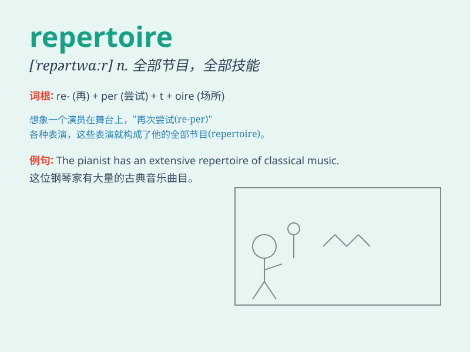

## repertoire

**英音:** _[\'repətwɑː]_ **美音:** _[\'rɛpɚ\'twɑr]_

**译义:**
*n.(准备好演出的)节目,保留剧目,(计算机的)指令表,指令系统,\<美>(某个人的)全部技能*

### 短语

+ **repertoire list:** _曲目列表_

+ **repertoire range:** _曲目范围_

+ **expand repertoire:** _扩大曲目_

+ **classical repertoire:** _古典曲目_

+ **repertoire selection:** _曲目选择_

### 例句

#### 例句1

> **The ballet company\'s repertoire includes both classic and
contemporary works.**

**中文翻译:** 这个芭蕾舞团的全部剧目包括经典和当代的作品。

**单词释义:** 全部剧目

#### 例句2

> **His musical repertoire is extensive, covering various genres.**

**中文翻译:** 他的音乐曲目非常广泛，涵盖了各种流派。

**单词释义:** 曲目

#### 例句3

> **The chef\'s repertoire of dishes is impressive.**

**中文翻译:** 这位厨师的菜品储备令人印象深刻。

**单词释义:** 储备

### 背诵小故事

> A young actor was struggling to remember his repertoire of roles. One
night, he dreamt of a magical stage where all his characters came alive
and showed him their unique parts. When he woke up, he never forgot his
repertoire again.

**一位年轻演员努力记住他的全部角色。一天晚上，他梦到一个神奇的舞台，所有角色都活了过来向他展示各自独特的部分。醒来后，他再也没忘记他的全部角色。**

### 图义

