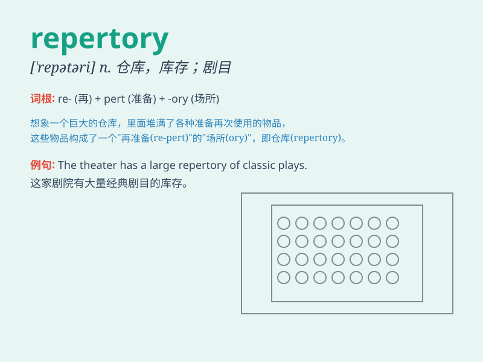

## repertory

**英音:** _[\'repət(ə)rɪ]_ **美音:** _[\'rɛpɚtɔri]_

**译义:** *n.仓库*

### 短语

+ **repertory company:** _定期换演剧目的剧团_

+ **repertory theatre:** _轮演剧目剧院_

+ **in repertory:** _（戏剧等）轮演_

+ **repertory grid:** _（心理学）反应表_

+ **repertory of skills:** _技能储备_

### 例句

#### 例句1

> **The theater has an extensive repertory of classic plays.**

**中文翻译:** 这家剧院有大量的经典戏剧剧目。

**单词释义:** 剧目；全部节目

#### 例句2

> **Her repertory of songs is very diverse.**

**中文翻译:** 她的歌曲曲目非常多样化。

**单词释义:** （某人的）全部节目；保留剧目

#### 例句3

> **The dance company\'s repertory includes both modern and
traditional pieces.**

**中文翻译:** 这家舞蹈公司的节目包括现代和传统的作品。

**单词释义:** （艺术团体的）全部作品

### 背诵小故事

>
想象一个巨大的仓库，里面堆满了各种表演所需的道具和节目。这个仓库就像一个\'repertory\'，储备着丰富的资源。演员们总能从中找到合适的东西来进行精彩的表演。

**想象一个仓库储备表演资源来辅助记忆单词\'repertory\'，意思是全部剧目，库存，储备**

### 图义

