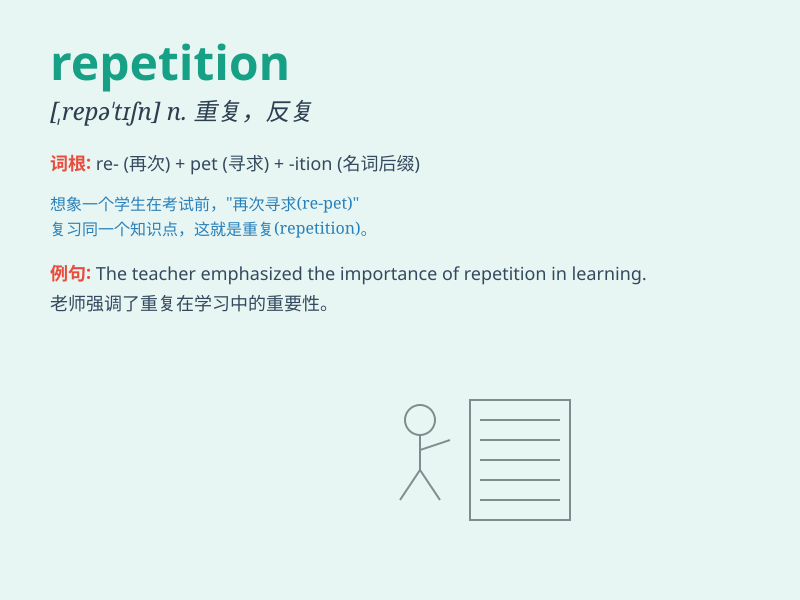

## repetition

**英音:** _[repɪ\'tɪʃ(ə)n]_ **美音:** _[\'rɛpə\'tɪʃən]_

**译义:** *n.重复,循环,复制品,副本*

### 短语

+ **constant repetition:** _不断的重复_

+ **repetition rate:** _重复率_

+ **avoid repetition:** _避免重复_

+ **repetition of words:** _单词的重复_

+ **mindless repetition:** _无意识的重复_

### 例句

#### 例句1

> **The constant repetition of the same song was annoying.**

**中文翻译:** 同一首歌不停地重复播放令人厌烦。

**单词释义:** 重复

#### 例句2

> **Repetition is the key to learning a language.**

**中文翻译:** 重复是学习语言的关键。

**单词释义:** 重复

#### 例句3

> **He made a mistake due to the repetition of the same error.**

**中文翻译:** 由于重复同样的错误，他犯了一个错。

**单词释义:** 重复

### 背诵小故事

> A little monkey was practicing climbing a tree. It did the same
action over and over. This continuous doing of the same thing was called
repetition. The monkey\'s repetition made it a master climber.

**一只小猴子在练习爬树。它一遍又一遍地做着相同的动作。这种持续做相同的事情就叫做重复。猴子的重复使它成为了爬树高手。**

### 图义

