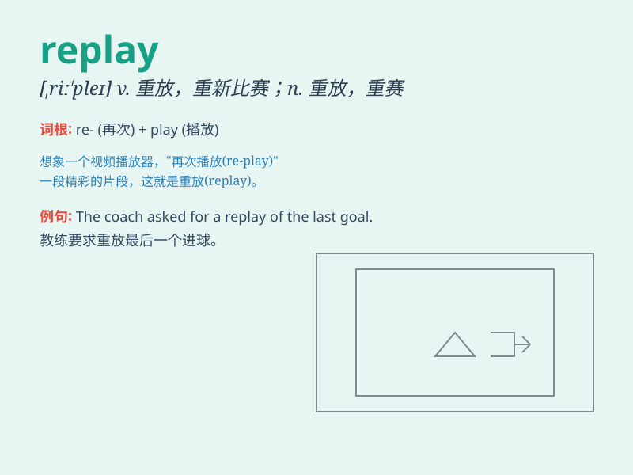

## replay

**英音:** _[riː\'pleɪ]_ **美音:** _[\'riple]_

**译义:** *vt.重新比赛,重新表演,重放n.重赛*

### 短语

+ **video replay:** _视频回放_

+ **replay value:** _重玩价值_

+ **replay feature:** _重放功能_

+ **instant replay:** _即时回放_

+ **replay button:** _重放按钮_

### 例句

#### 例句1

> **I want to replay the football match I missed yesterday.**

**中文翻译:** 我想重放我昨天错过的足球比赛。

**单词释义:** 重放

#### 例句2

> **Let\'s replay the scene to figure out what went wrong.**

**中文翻译:** 让我们重新演绎这个场景来找出哪里出了问题。

**单词释义:** 重新演绎

#### 例句3

> **The coach asked the team to replay the final minutes of the
game.**

**中文翻译:** 教练要求球队重新演练比赛的最后几分钟。

**单词释义:** 重新演练

### 背诵小故事

> A football player was very sad because he missed a crucial goal. But
the coach comforted him, saying they could replay the game and he had a
chance to make it right.

**一位足球运动员因为错失关键进球非常伤心。但教练安慰他说他们可以重赛，他有机会改正。**

### 图义

