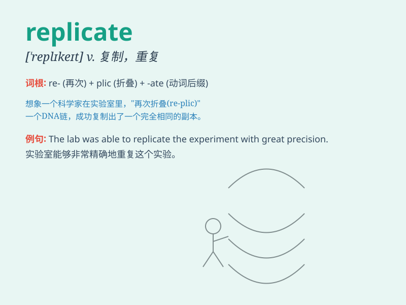

## replicate

**英音:** _[\'replɪkeɪt]_ **美音:** _[\'rɛplɪket]_

**译义:** *v.复制*

### 短语

+ **replicate experiment:** _重复实验_

+ **replicate data:** _复制数据_

+ **replicate success:** _复制成功_

+ **replicate pattern:** _复制模式_

+ **replicate structure:** _复制结构_

### 例句

#### 例句1

> **Scientists are trying to replicate the results of the
experiment.**

**中文翻译:** 科学家们正试图复制该实验的结果。

**单词释义:** 复制；重现

#### 例句2

> **This pattern can be replicated in different materials.**

**中文翻译:** 这种模式可以在不同的材料中复制。

**单词释义:** 复制；模仿

#### 例句3

> **The computer virus replicates itself very quickly.**

**中文翻译:** 这计算机病毒自我复制得非常快。

**单词释义:** 自我复制

### 背诵小故事

> A scientist was trying to replicate an experiment. He followed the
same steps exactly, hoping to get the same results. Just like making a
copy of something, he aimed to replicate the success of the previous
trial.

**一位科学家试图复制一个实验。他严格遵循相同的步骤，希望得到相同的结果。就像复制某物一样，他旨在重复之前实验的成功。**

### 图义

