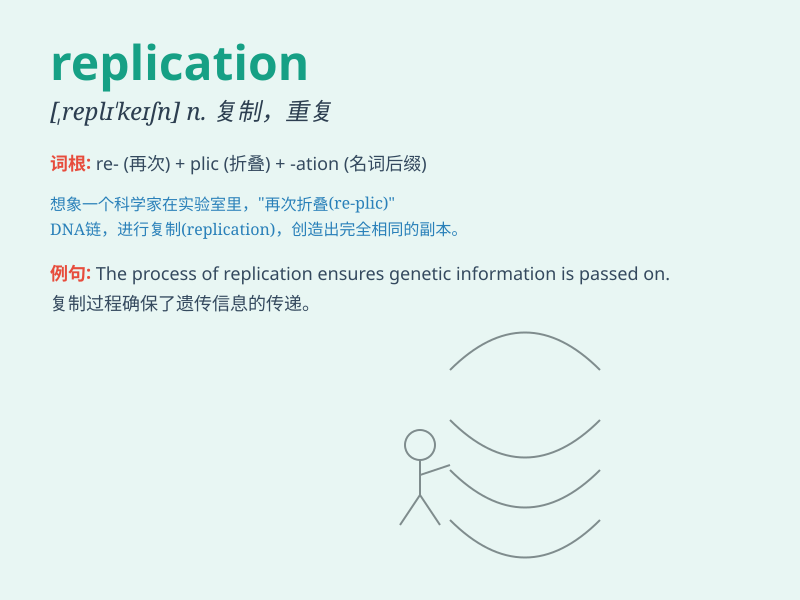

## replication

**英音:** _[ˌreplɪ\'keɪʃ(ə)n]_ **美音:**
_[ˌreplɪ\'keɪʃ(ə)n]_

**译义:** *n.复制*

### 短语

+ **DNA replication:** _DNA 复制_

+ **replication factor:** _复制因子_

+ **replication fork:** _复制叉_

+ **replication bubble:** _复制泡_

+ **viral replication:** _病毒复制_

### 例句

#### 例句1

> **The replication of DNA is a fundamental process in cell
division.**

**中文翻译:** DNA 的复制是细胞分裂中的一个基本过程。

**单词释义:** 复制

#### 例句2

> **We need to ensure the replication of this successful experiment
in other labs.**

**中文翻译:** 我们需要确保这个成功的实验在其他实验室得以复制。

**单词释义:** 复制；重复

#### 例句3

> **The replication of the virus occurs rapidly within the host
organism.**

**中文翻译:** 病毒在宿主生物体内迅速复制。

**单词释义:** 复制

### 背诵小故事

> A scientist was working hard on a project. The key part was
replication. He needed to make exact copies of an experiment to prove
his theory. Finally, he succeeded through precise replication.

**一位科学家正在努力做一个项目。关键部分是复制。他需要对一个实验进行精确复制以证明他的理论。最终，他通过精准的复制成功了。**

### 图义

