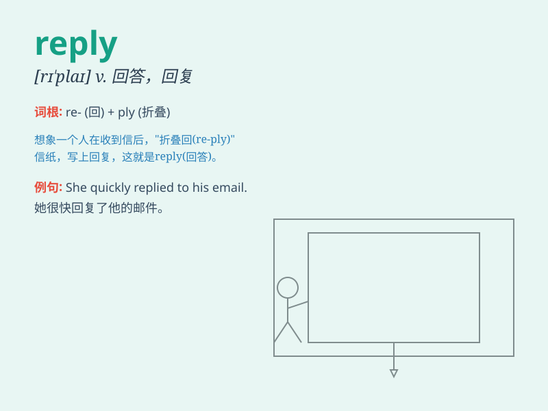

## reply

**英音:** _[rɪ\'plaɪ]_ **美音:** _[rɪ\'plai]_

**译义:** *n.答复,报复,答辩vi.答复,回击,报复,答辩vt.回答*

### 短语

+ **reply to:** _回答；答复_

+ **in reply:** _作为答复_

+ **make a reply:** _作出答复_

+ **reply for:** _代表\...作答_

+ **prompt reply:** _迅速回复_

### 例句

#### 例句1

> **Please reply to my email as soon as possible.**

**中文翻译:** 请尽快回复我的电子邮件。

**单词释义:** 回复

#### 例句2

> **He didn\'t reply to my question.**

**中文翻译:** 他没有回答我的问题。

**单词释义:** 回答

#### 例句3

> **She replied with a smile.**

**中文翻译:** 她微笑着回答。

**单词释义:** 回答

### 背诵小故事

> One day, Tom sent a message to Mary. Mary quickly gave a response,
which was her reply. It made Tom very happy. This shows that a reply is
a response given when someone communicates with you.

**一天，汤姆给玛丽发了一条消息。玛丽很快给出了回应，这就是她的回复。这让汤姆非常开心。这表明
reply 就是当有人与你交流时给出的回应。**

### 图义

