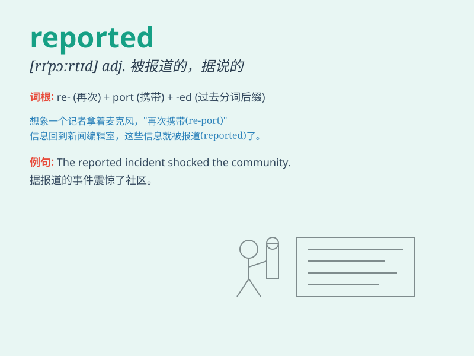

## reported

**英音:** _[rɪˈpɔːrtɪd]_ **美音:** _[rɪˈpɔːrtɪd]_

**译义:** *adj. 被报道的，据说的；v. 报告，汇报（report
的过去式和过去分词）*

### 短语

+ **reported speech:** _间接引语_

+ **reported crime:** _报案的犯罪_

+ **reported case:** _报告的案例_

+ **reported earnings:** _公布的收益_

+ **reported loss:** _报告的损失_

### 例句

#### 例句1

> **It was reported that the accident caused several injuries.**

**中文翻译:** 据报道，这次事故造成了几人受伤。

**单词释义:** 被报道

#### 例句2

> **The reported crime rate has decreased this year.**

**中文翻译:** 今年报道的犯罪率有所下降。

**单词释义:** 报道的

#### 例句3

> **She reported seeing a strange man near her house last night.**

**中文翻译:** 她报告说昨晚在她家附近看到一个陌生男人。

**单词释义:** 报告

### 背诵小故事

> A journalist was always reported the truth. One day, he reported a
big event accurately and became famous. People trusted his reported
news. Remember, reported means gave an account of something.

**一位记者总是报道真相。有一天，他准确地报道了一个大事件并出名了。人们信任他所报道的新闻。记住，reported
意思是给出关于某事的描述。**

### 图义

