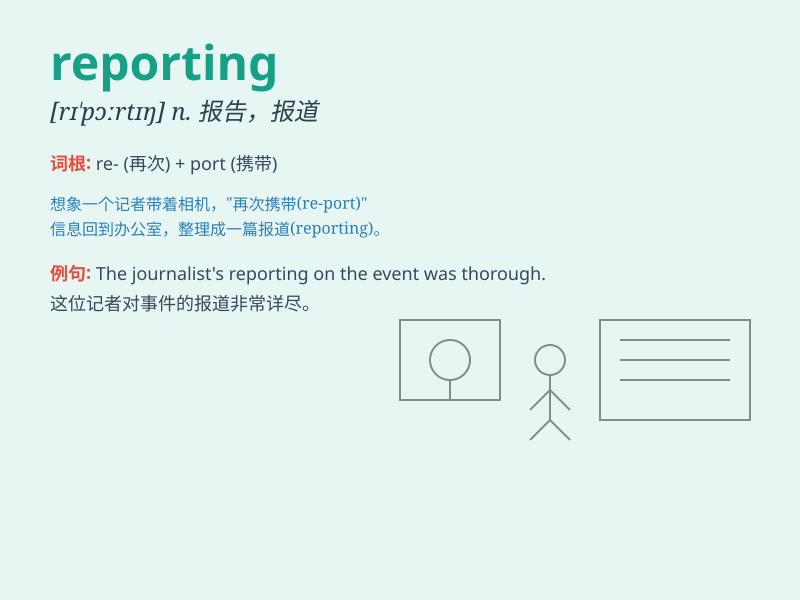

## reporting

**英音:** _[rɪ\'pɔːtɪŋ]_ **美音:** _[rɪ\'pɔrtɪŋ]_

**译义:** *n.报告*

### 短语

+ **financial reporting:** _财务报告_

+ **news reporting:** _新闻报道_

+ **environmental reporting:** _环境报告_

+ **audit reporting:** _审计报告_

+ **performance reporting:** _绩效报告_

### 例句

#### 例句1

> **The reporting of the incident was very detailed.**

**中文翻译:** 对这一事件的报道非常详细。

**单词释义:** 报道；报告

#### 例句2

> **She is responsible for financial reporting in the company.**

**中文翻译:** 她负责公司的财务报告。

**单词释义:** 报告；汇报

#### 例句3

> **The newspaper has a good reputation for accurate reporting.**

**中文翻译:** 这家报纸因准确的报道而享有良好声誉。

**单词释义:** 报道；新闻报道

### 背诵小故事

> A journalist was assigned the task of reporting on a mysterious
event. He spent days gathering facts and finally presented a detailed
and accurate reporting that clarified everything.

**一位记者被指派报道一个神秘事件的任务。他花了几天时间收集事实，最后提交了一份详细且准确的报道，把一切都解释清楚了。**

### 图义

