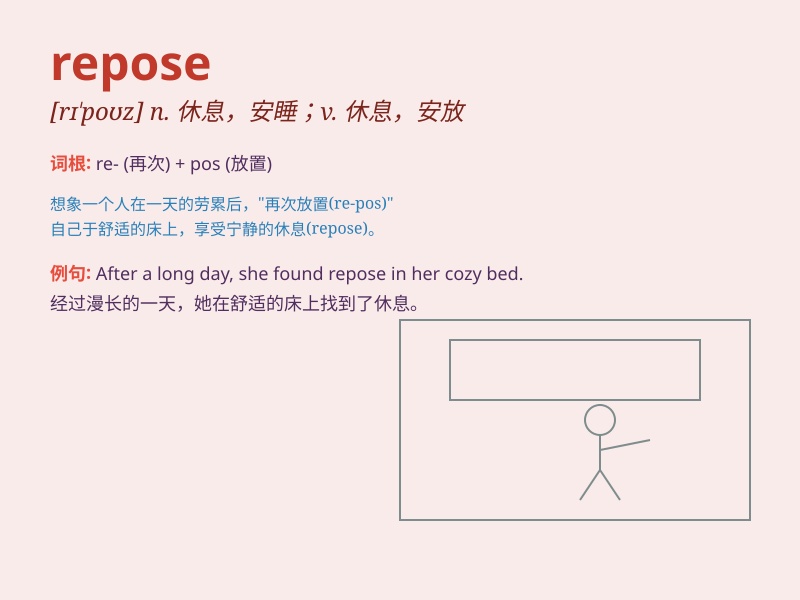

## repose

**英音:** _[rɪ\'pəʊz]_ **美音:** _[rɪ\'poz]_

**译义:**
*n.休息,睡眠,静止vt.使休息,寄托于vi.休息,长眠,静卧,建立于,座落,依靠*

### 短语

+ **repose on:** _依靠；基于_

+ **repose in:** _在于；存在于_

+ **repose of mind:** _心境安宁_

+ **find repose:** _找到安息；得到休息_

+ **grant repose:** _给予安息；准予休息_

### 例句

#### 例句1

> **The cat reposed peacefully on the sofa.**

**中文翻译:** 这只猫安静地在沙发上休息。

**单词释义:** 休息；安睡

#### 例句2

> **She found repose in the mountains after a stressful week.**

**中文翻译:** 在紧张的一周之后，她在山里找到了宁静。

**单词释义:** 宁静；平静

#### 例句3

> **His confidence reposes on his excellent skills.**

**中文翻译:** 他的自信基于他出色的技能。

**单词释义:** 基于；依靠

### 背诵小故事

>
想象一下，一位疲惫的旅行者在宁静的森林中找到了一处舒适的角落。他躺在柔软的草地上，身心完全放松，进入了宁静的睡眠状态。这就是\'repose\'，意味着休息、睡眠、安宁。

**想象一位疲惫的旅行者在森林中找到舒适角落休息的情景来理解\'repose\'，其意思是休息、睡眠、安宁。**

### 图义

