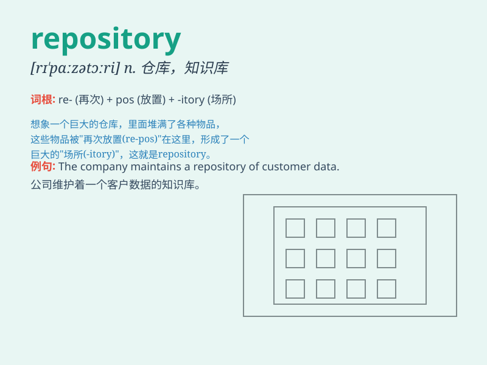

## repository

**英音:** _[rɪ\'pɒzɪt(ə)rɪ]_ **美音:**
_[rɪ\'pɑzə\'tɔri]_

**译义:** *n.贮藏室,智囊团,知识库,仓库*

### 短语

+ **data repository:** _数据存储库_

+ **code repository:** _代码库_

+ **knowledge repository:** _知识宝库_

+ **document repository:** _文件库_

+ **image repository:** _图像库_

### 例句

#### 例句1

> **The library serves as a repository of knowledge.**

**中文翻译:** 图书馆充当着知识的宝库。

**单词释义:** 宝库；存放处

#### 例句2

> **This website is a repository of useful information.**

**中文翻译:** 这个网站是有用信息的存放处。

**单词释义:** 存放处；仓库

#### 例句3

> **The museum is a repository of ancient artworks.**

**中文翻译:** 博物馆是古代艺术品的收藏库。

**单词释义:** 收藏库；贮藏室

### 背诵小故事

> Imagine a huge library filled with all kinds of knowledge. This
library is like a repository. It stores and keeps all the precious books
and information safe. Just like that, a repository stores things for
later use.

**想象一个巨大的图书馆，里面充满了各种各样的知识。这个图书馆就像一个仓库。它存储并妥善保管着所有珍贵的书籍和信息。同样，repository
就是用来存储东西以供日后使用的。**

### 图义

