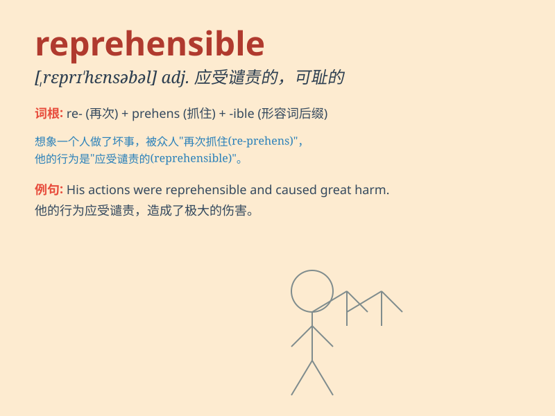

## reprehensible

**英音:** _[,reprɪ\'hensɪb(ə)l]_ **美音:**
_[,rɛprɪ\'hɛnsəbl]_

**译义:** *adj.应斥责的,应该谴责的*

### 短语

+ **reprehensible conduct:** _应受谴责的行为_

+ **reprehensible act:** _应受指责的举动_

+ **reprehensible behavior:** _应受斥责的行为_

+ **reprehensible mistake:** _应受批评的错误_

+ **reprehensible attitude:** _应受指责的态度_

### 例句

#### 例句1

> **His behavior at the party was reprehensible.**

**中文翻译:** 他在聚会上的行为应受谴责。

**单词释义:** 应受谴责的

#### 例句2

> **The company\'s reprehensible practices led to public outcry.**

**中文翻译:** 该公司应受指责的做法引起了公众的强烈抗议。

**单词释义:** 应受指责的

#### 例句3

> **It is reprehensible to cheat in an exam.**

**中文翻译:** 在考试中作弊是应受谴责的。

**单词释义:** 应受谴责的

### 背诵小故事

> A thief was caught stealing from an old lady. His behavior was
reprehensible. Everyone criticized him for such a bad act. It means
deserving strong condemnation or blame.

**一个小偷被抓到偷一位老太太的东西。他的行为应受谴责。每个人都因他这种恶劣行为而批评他。这个单词意思是应受严厉谴责或责备的。**

### 图义

